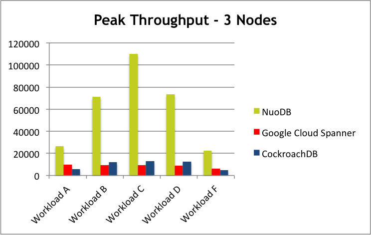

*Outline*

[TOC]

NewSQL概念几乎是紧跟着NoSQL之后变得火热的。Google Bigtable与AWS Dynamo奠定了NoSQL技术的根基，而Google Spanner&F1则引领了NewSQL技术的发展。本文首先探讨NoSQL与NewSQL的概念与范畴，随后结合一些业界观点以及两者之间的优缺点对比，来论述各自的应对场景以及未来的演变趋势。

# NoSQL

众所周知，NoSQL已是一个很广泛的概念。现在被大家所广泛认知的NoSQL一词，源自2009年在San Francisco举办的一次[Meetup](https://www.eventbrite.com/e/nosql-meetup-tickets-341739151#)，该Meetup的描述信息如此阐述：

> This meetup is about **"open source, distributed, non relational databases"**.
>
> Have you run into limitations with traditional relational databases? Don't mind trading a query language for scalability? Or perhaps you just like shiny new things to try out? Either way this meetup is for you.

传统的RDBMS在Scalability能力上的受限，是促使NoSQL技术出现的一个关键因素。在这次Meetup的主题中，涉及到了Cassandra、HBase、MongoDB、CouchDB、HyperTable等开源技术，而该Meetup描述信息中所提及的**"open source, distributed, non relational databases"**为NoSQL技术给出了精炼的描述。彼时，SQL几乎是RDBMS的代名词，自然而言的，Non-SQL也成了Non-Relational的代名词。

随着近些年的快速发展，SQL已经逐步被应用在了更广泛的领域，因此，SQL已不再是RDBMS的专属特征，NoSQL技术体系中也引入了SQL能力，因此而演变出来的**Not-Only-SQL**的概念，虽有自圆其说之嫌，但的确给出了更合理的解读。无论如何，**"open source, <u>distributed</u>, <u>non relational databases</u>"**关于大多数NoSQL技术边界的定义，也依然是合理的，只是，**"open source"**是一个可选特征，而**"distributed"**以及**"non relational"**却是**<u>典型NoSQL技术</u>**的基本特征。大多数NoSQL技术，弱化了对ACID语义以及复杂关联查询的支持，采用了更加简洁或更加专业的数据模型，优化了读写路径，从而能够换取更高的读写性能。

# NewSQL

NewSQL可以说是传统的RDBMS与NoSQL技术结合之下的产物，如下是Wiki中为[NewSQL](https://en.wikipedia.org/wiki/NewSQL)给出的定义：

> **NewSQL** is a class of modern [relational](https://en.wikipedia.org/wiki/Relational_database_management_system) [database management systems](https://en.wikipedia.org/wiki/Database_management_system) that seek to provide the same scalable performance of [NoSQL](https://en.wikipedia.org/wiki/NoSQL) systems for [online transaction processing](https://en.wikipedia.org/wiki/Online_transaction_processing) (OLTP) read-write workloads while still maintaining the [ACID](https://en.wikipedia.org/wiki/ACID) guarantees of a traditional database system.

因此，可以将**<u>典型NewSQL技术</u>**理解成**分布式关系型数据库**，能够支持**分布式事务**是一个基本前提。NoSQL与NewSQL在技术栈上有很多重叠，但在是否支持关系型模型及对复杂事务的支持力度上是存在明显区别的。某些地方也将NewSQL划在Not-Only-SQL的范畴之内，即NewSQL技术也被纳入到NoSQL概念体系中，该说法虽也合理，但使得NoSQL一词过于泛化。

# 业界观点

近期，Timescale DB的联合创始人Ajay Kulkarni曾经发表过如下一篇文章：

[“Why SQL is beating NoSQL, and what this means for the future of data”](https://blog.timescale.com/why-sql-beating-nosql-what-this-means-for-future-of-data-time-series-database-348b777b847a)

文章标题话题感十足，主要观点总结如下：

* 很多新兴技术都已经在拥抱SQL，如AWS  Aurora, Google Spanner, Kafka也已经支持了SQL接口等等。
* 大多数NoSQL技术都定义了独立的且不完善的查询语言接口(DSL)，尽管有些NoSQL技术提供了SQL-Like接口，但与标准SQL接口兼容性极差。
* NewSQL的兴起，而且开始积极拥抱标准SQL接口。Spanner是典型的例子，最初版本的Spanner的SQL语法的支持度是非常受限的，而最近几年的时间里一直在不断完善SQL语法的支持。
* 在当前时代，数据的价值越来越大，SQL依然是不同数据源之间的标准接口。而关于SQL语法的支持度，是未来数据分析工作的最大瓶颈点。

关于这篇文章的这几个主要观点，笔者是完全认可的，但完全不认可标题中所给出的误导性内容，SQL的回归并不意味着NoSQL技术将会被完全取代，正如下面一篇文章中关于Ajay Kulkarni观点的评论：

["SQL is not beating NoSQL. NoSQL is evolving"](https://blog.dgraph.io/post/sql-vs-nosql/)

> The analysis was mostly agreeable, except for one major flaw. It is not SQL which is making a comeback, its NoSQL which is morphing into providing a familiar interface.

SQL的回归，恰恰是NoSQL技术在不断演进的结果。

# 技术分类法

在探讨一个分布式存储技术时，简单的将其归类为NoSQL或者NewSQL是不合理的，像Bigtable/HBase/Dynamo是**典型NoSQL技术**，而Spanner/CockroachDB以及国内的TiDB，可以将其归类为**典型NewSQL技术**，但像Kudu，它本身的存储引擎层是典型NoSQL技术，而在此基础上提供了完善的SQL能力以及复杂的事务支持，因此，它兼顾了NoSQL与NewSQL的很多特征，更像是集两者于一身的技术。

因此，非NoSQL即NewSQL的简单二分法是不合理的，很多技术都在将两者进行不断的融合，至于这个合理的平衡点在哪里，要取决于这个分布式存储技术要解决的核心问题是什么。

当我们谈论NoSQL，更多的是在谈论一种分布式、非关系型数据存储技术，而谈起NewSQL，更多可能是在讨论一种分布式关系型数据库技术。当用NoSQL或者NewSQL来为一个技术进行归类时，更多考虑的可能是该技术更像什么，例如，如果提供了标准SQL接口以及复杂事务能力，优先使用NewSQL一词来描述是更加贴切的，但该技术幕后的存储引擎，也许是基于NoSQL技术实现的。

# 最后的总结

在阐述了NoSQL与NewSQL的概念以及两者的范畴之后，再回到本文标题中所提出来的命题，该命题似乎成了一个伪命题，因为两者也都在慢慢演进/融合。所以，对该命题存在疑惑的人，更多是针对如下命题：

​	<u>分布式关系型数据库技术</u>是否会取代<u>分布式非关系型数据存储技术</u>？

分布式关系型数据库技术在分布式事务以及关系型模型上的强化，导致在数据吞吐量／并发能力上的弱化。借助NuoDB官方提供的一个NuoDB与Spanner/Cockroach的benchmark对比结果([“原文:Benchmarking Google Cloud Spanner, CockroachDB, and NuoDB"](https://www.nuodb.com/techblog/benchmarking-google-cloud-spanner-cockroachdb-nuodb))来进一步说明该观点：

上图中的Workload定义：

>A – Heavy update (50% read, 50% update)
>B – Mostly read (95% read, 5% update)
>C – Read-only (100% read)
>D – Read the latest inserted (90% read, 10% insert)
>E – Scan the latest inserted (90% read, 10% insert)
>F – Read-modify-write (50% read, 50% update)

可以看出，无论哪种Workload下，Spaner与CockroachDB的Throughput都是很低的。尽管NuoDB也可以归类到 NewSQL的范畴中，但它也大量借鉴了NoSQL技术，将事务机制与持久化机制分层处理以及更好的利用缓存技术是性能取得质的提升的关键。上图中部分Workload中，NuoDB的Throughput几乎达到了主流 NoSQL技术的Throughtput水准，但还是可以看出，当读写比例相当或者写多读少的场景下，NuoDB的Throughput较之主流的NoSQL技术存在明显的差距。

因此，分布式关系型数据库技术与分布式非关系型数据存储技术依然是针对不同的应用场景的，前者主要还是针对传统RDBMS的部分应用场景，而分布式非关系型数据存储技术，则更适合高吞吐、高并发的新兴应用场景，而随着物联网、车联网的不断普及，分布式非关系型数据存储技术也会带来更大的价值。两者还会走向进一步的融合，也会看到更彻底的分离。

