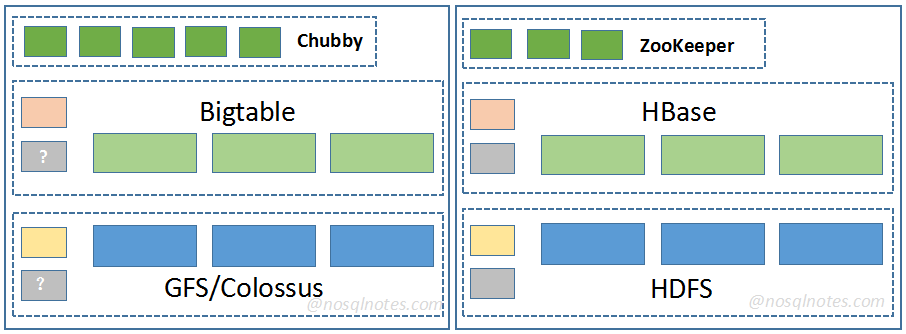
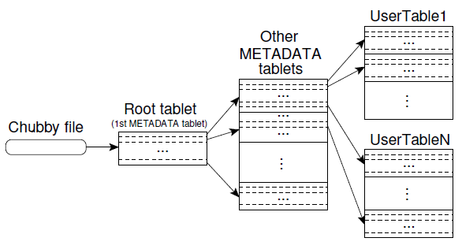
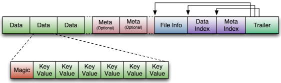
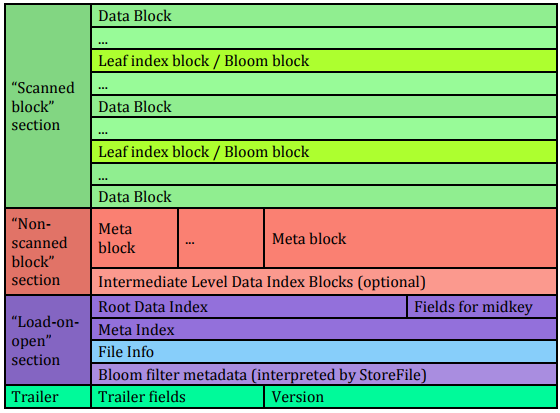

# HBase Vs Bigtable

## 基础架构



Bigtable与HBase在技术栈上的组成是类似的：

* GFS/Colossus对应HDFS
* Chubby对应ZooKeeper

Bigtable与GFS/Colossus中的管理节点是否支持备节点，在相关材料中并没有提及，这里猜测这应该是需要具备的一个基础能力。

## Column Family

Column Family是一些列的集合，在这层概念上，两者是类似的。但有如下明显的区别：

* 物理存储

  Bigtable的Column Family更像是一个逻辑概念，多个Column Families可以组成一个Locality Group。同一个Locality Group中的多个Column Families数据可以被存储在同一个SSTable文件中。

  HBase中的不同的Column Family的数据是隔离在不同的存储路径中的。
* 支持的数量

  Bigtable的Column Family相对更加轻量级，因此数量通常可以配置为几十个级别。

  HBase的Column Family数量通常不建议过多，通常小于5个。
* 可配置性

  Bigtable中允许配置的参数非常少，相对而言，HBase中提供的配置参数更加多样化。


## WAL

* 单节点提供写服务的WAL数量


  Bigtable: 一个Tablet Server在任意时间点只支持一个正在提供写服务的WAL，

  HBase:  1.0+版本中，HBase已经支持Multi-WAL特性，即同一个RegionServer(对应Tablet Server)在任意时间点可同时支持多个提供写服务的WAL，可更充分的利用磁盘IO能力。


* 写内存与写WAL的顺序

  WAL的全称Write-Ahead-Log，顾名思义，数据在写入到Memtable/MemStore之前，应该要首先写入到WAL中保证数据的可靠性。Bigtable与早期的HBase版本的确也都是这么做的。但后来，HBase调整了两者的顺序，数据先写入到MemStore中，而后再写WAL，如果WAL写不成功，则回滚MemStore中的数据。这样是为了更快释放行锁，加快性能。

* 性能／时延优化

  Bigtable中支持Group Commit能力，同时利用Two-Writing Threads来优化访问时延，有效缓和因GFS的读写IO带来的时延毛刺问题。

  HBase中基于Disruptor提供高并发下的Group Commit能力，减少Sync请求次数；支持WAL异步Sync能力。


## Access Control

* Bigtable的最小权限控制单元为Column Family。
* HBase不仅支持Column Family级别，也可支持到Cell-Level。


## Flush&Compaction

在功能上，两者无明显差别，只是在概念名称上有所不同。

* Bigtable中的Minor Compaction过程，在HBase中称之为Flush。Bigtable经Minor Compaction之后生成的文件为SSTable，HBase中经Flush之后生成的文件为HFile。
* Bigtable中的Merge Compaction过程，对应于HBase中的Minor Compaction。
* Bigtable中的Major Compaction在HBase中也称之为Major Compaction。

关于Compaction算法，Bigtable论文中并没有过多透露。HBase目前能够支持多种Compaction算法，且支持插件化定制。

## 子表路由

Bigtable中的Tablet，在HBase中称之为Region，为了能够统一一下名称，这里统计将其称之为子表。

Bigtable的子表路由是有三层组成的：



HBase的早期版本中，也是与Bigtable类似的三层路由结构。但从HBase 0.98版本开始，移除了Root表，直接将META表的路由信息存储在了ZooKeeper中。另外，在当前HBase版本中，META子表依然是不可分裂的。

## 读写时延

上篇文章[<Bigtable在近些年的演进>](http://www.nosqlnotes.com/techpoints/bigtable-latestupdate/)中，讲到了Bigtable在读写时延方面所做的一些改进。

从Cloud Table官方提供的平均时延与P99读写时延方面来看，这一点比起HBase的确有一些优势。

## 底层存储文件

* Bigtable的底层文件存储格式为SSTable，这是Google内部多项目共享的文件存储格式，先于Bigtable而出现。关于SSTable的组成结构，可以从LevelDB的File Format定义中找到：

  ```
  <beginning_of_file>
  [data block 1]
  [data block 2]
  ...
  [data block N]
  [meta block 1]
  ...
  [meta block K]
  [metaindex block]
  [index block]
  [Footer]  (fixed size; starts at file_size - sizeof(Footer))
  <end_of_file>
  ```

* HBase的底层文件存储格式为HFile，是HBase的自定义格式，目前已经演进到第三代。

  HBase的第一代文件格式HFile的定义与上面的SSTable的结构是类似的：

  

  在支持该格式的时候，HBase的Region数据量不建议超过GB级别（可以推断，Bigtable的一个Tablet的大小也应该不超过该级别），尤其是带有Bloom Filter数据时，HBase RegionServer服务启动时非常慢，因为需要加载所有的元数据信息，内存占用也非常多。因此，HBase演进出了第二代HFile格式：

  

  将元数据部分也分成了多层，启动时仅加载第一层的元数据信息，其它的元数据按需加载。这样不仅能够启动速度，更能有效降低内存占用大小。关于HFile的结构，这里不做过多的展开。


## 高级特性

上篇文章[<Bigtable在近些年的演进>](http://www.nosqlnotes.com/techpoints/bigtable-latestupdate/)中也提到，在Bigtable官方公布的材料中，并未见到明显的大特性。对比而言，HBase在近些年新增了很多新特性，这里仅做简单的罗列：

* Snapshot  表支持数据快照
* Namespace 表命名空间
* Replication 跨集群异步容灾特性
* Region Replica 一个Region能够有多个副本，当主副本不可用时，备副本可提供弱一致性读取模式，提高读请求的高可用性
* In-memory Flush & Compaction  可有效降低因频繁Flush与Compaction带来的IO读写放大
* .......


这些特性在后面的文章中将会展开详细介绍。


*References*

1. https://github.com/google/leveldb/blob/master/doc/table_format.md
2. https://issues.apache.org/jira/browse/HBASE-3857
3. Bigtable: A Distributed Storage System for Structured Data
