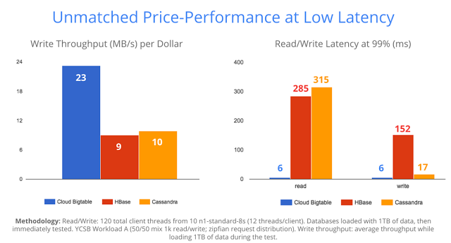

#Bigtable在近些年的演进

关于Bigtable在近些年做了哪些演进，只能从Cloud Bigtable的官方资料中一探究竟。在详细的分析了Cloud Bigtable的官方资料之后，遗憾的发现，除了云服务本身所需要的一些基础能力，以及为了吸引HBase存量用户而做的HBase接口兼容性工作以外，其它的Features可谓是"捉襟见肘"。

## 曾经的规划

在Bigtable论文中，曾提及当时团队成员正忙于二级索引以及跨集群容灾特性的开发：

> We are in the process of implementing several additional Bigtable features, such as support for secondary indices and infrastructure for building cross-data-center replicated Bigtables with multiple master replicas.	

直到今天我们所看到的Cloud Bigtable，也未见到这两个特性，猜测当时的部分团队成员已经转向MegaStore的开发，或者后来发现这些能力放在一个上层系统中更加合适：

* 在Bigtable中实现二级索引，无非是在现有的Key-Value的接口基础上实现增量。
* 如要支持跨集群容灾能力，在当前架构下，可基于WAL日志的异步复制方案来实现。如构建同步容灾方案，对当前的架构提出了非常大的挑战。

这些能力本身已涵盖在MegaStore的设计中，所以干脆放弃在Bigtable中支持这些能力，这样还可以继续保持其系统的精简性。

## Cloud Bigtable与HBase

Cloud Bigtable的官方资料中，HBase接口被暴露在最显眼的位置，纵观整个资料上下文，也可以发现HBase的身影“处处可见”。HBase的实现基本上参考了Bigtable论文中的设计，但Bigtable如果介绍一套崭新的接口所需要付出的代价可想而知，所以不得不依靠兼容HBase接口来吸纳更多的用户，可以理解这其中有多少不得已的“苦衷”。相信在很多年前，Google内部关于Bigtable是否开源就已经做过不少讨论，但这是一个“牵一发而动全身”的动作，因为Bigtable用到了很多Google内部的组件。

从接口能力上，可以简单对比出来Bigtable与HBase的一些异同：

* Column Family的可配置参数
* ACL控制的粒度
* Reverse Scan能力
* 支持的Filter种类
* Coprocessor/Snapshot/Namespace/Procedure等高级特性
* 集群管理/表管理接口

在后面的文章中将会再给出Bigtable与HBase的详细对比分析。

## Bigtable在请求时延上的优化

从2015年Cloud Bigtable刚刚开放公测时，他们的工程师曾发表过一篇博客文章：

[Announcing Google Cloud Bigtable](https://cloudplatform.googleblog.com/2015/05/introducing-Google-Cloud-Bigtable.html)

这篇文章重点在写吞吐以及P99读写时延方面与HBase/Cassandra做了对比：

可以看出，无论是在吞吐量以及P99 Read/Write Latency方面，Bigtable都有显著的优势。虽然近几年HBase在性能上已经取得了不少改进，在P99读写时延方面的确比较诟病，主要受限于底层的HDFS能力。

Jeff Dean在2014年的一个演讲([Achieving Rapid Response Times in Large Online Services](https://conferences.oreilly.com/velocity/velocity2014/public/schedule/detail/34266))中，曾提到Bigtable在读写时延优化方面所做的一些工作，一些关键点包括：

* Request Adaptation 基于最近的一些读取时延统计来做出一些预判来改善接下来的读取请求时延
* Backup Request 原理很简单，当某个副本查询响应超出一定时间之后立马将请求发送至另外一个副本，这样可有效降低时延毛刺，类似技术如DistributedLog中的Speculative Read以及HDFS的Hedged Read特性。

## 其它

Cloud Bigtable支持多语言客户端，以及与Google Cloud服务的一些对接，都可归类于云服务基础能力，本文不作过多的展开。

## 写在最后

与HBase的活跃社区相对比，Bigtable在近些年的发展似乎非常缓慢。一个闭源技术，如不是战略级产品，公司就难有坚定的投入，最后的结局都可以预见。除非云上服务能够大卖，但恐怕大势已去.....

*Reference*

1. https://cloud.google.com/bigtable/

2. https://conferences.oreilly.com/velocity/velocity2014/public/schedule/detail/34266

3. https://cloudplatform.googleblog.com/2015/05/introducing-Google-Cloud-Bigtable.html

   ​