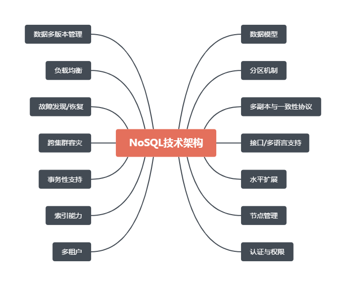
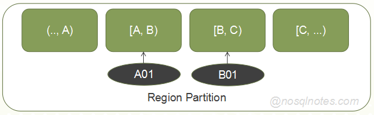
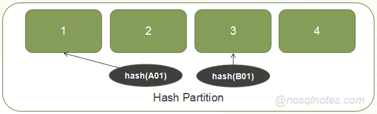
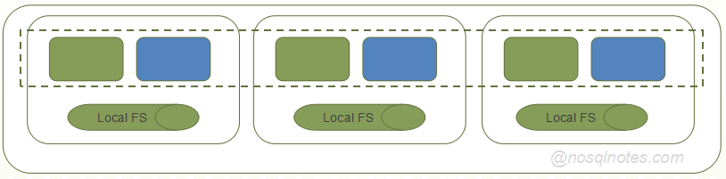
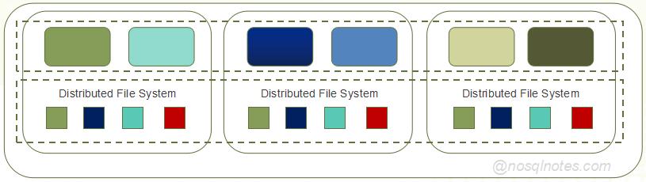

一个完整的NoSQL系统，设计到非常多的基础能力与特性，本文主要探讨决定一个NoSQL系统架构的关键要素，这些关键要素主要包括数据模型、分区策略、多副本机制、一致性级别、事务性级别以及索引能力，而其它的一些基础特性，无非是在该架构基础上所做的一些增量。

 # 数据模型

NoSQL数据模型是一个分布式数据存储系统用来抽象现实世界中的数据以及关联信息的方法。如下是Wiki中关于Data Model的定义：

> A **data model** is an abstract model that organizes elements of data standardizes how they relate to one another and to properties of the real world entities

一个NoSQL系统中的数据组织方式，直接影响到了该NoSQL系统擅长提供什么样的数据访问能力。

如Bigtable的Column Family/Key-Value的数据组织方式，就非常擅长基于Key值查询某一个列族中的所有列，但如果是基于任意某一个列的统计查询，是相对较弱的。

至于底层的存储文件格式，完全取决于该数据模型的设计。

# 分区策略

一个NoSQL系统通常涉及到多个数据分区，数据分区算法就是将一条用户数据关联到对应数据分区的方法。常见的分区算法有如下两种：

* Range分区

  每一个分区是一个Key值区间，用户数据Key值关联哪个区间就属于哪个分区。

  

* Hash分区

  基于用户数据Key的Hash值进行分区。

  

有的系统仅支持一种分区策略，也有的能够同时支持两种分区策略，实际使用时由用户选择配置。

# 多副本机制

有的在计算层面就提供了多副本机制，有的系统则依赖于底层的分布式文件系统来提供多副本机制。

* 计算层多副本

* 存储层多副本

上图仅仅展现计算与存储"逻辑"分离而物理不分离的情形。事实上，计算与存储也可以实现物理分离的。

# 一致性级别

通常的一致性级别分为三种级别：

* Strong Consistency

  强一致性级别。

  该一致性级别的定义为：如果在T1时刻成功写入了某一条数据，该数据对于在T2时刻(T2 > T1)发起的请求就是可见的。

  在一个依赖于存储层多副本的NoSQL系统中（计算层单副本），很容易实现强一致性。

* Eventual Consistency

  最终一致性级别。

  在写数据时，可能无法保障所有的副本都写成功，但系统内部有机制可以实现最终同步。

  在该一致性级别下，尽管有相关技术能够保障读取时尽可能读取到新副本的数据，但在一些异常场景下依然可能读到过期的数据。

  最终一致性多见于一个在计算层体统多副本机制的NoSQL系统中，当前主流的方案依赖于Paxos/Raft来实现计算层的多副本数据同步，该方案复杂度非常高。

其实在强一致性与最终一致性之间，还可以有更多级别的定义。如在Cassandray的一致性级别定义中，能够支持多达10种不同的一致性级别定义，这里暂不多述。

# 事务性级别

对事务性级别的支持级别，可能直接会影响到一个系统的架构。以Google的Bigtable/MegaStore/Spanner为例：

* Bigtable: 仅支持行级事务。
* MegaStore: 能够支持分区级别复杂事务。
* Spanner: 支持全局级别的复杂事务。

对事务性不同级别的需求，是促使MegaStore/Spanner系统诞生的一个最关键因素。

# 索引能力

一个NoSQL系统，在索引能力的支持上也分为如下几种级别：

* 主键索引

  这是一个NoSQL系统所要支持的最基础的索引能力。

  图存储系统看似要比Key-Value类型的NoSQL系统在索引能力上更复杂一些，其实核心原理也是基于主键索引查询，只不过默认提供了几种类型的主键而已。

* 二级索引

  在主键索引之外，提供基于其它字段/属性的索引能力。

  只有部分NoSQL系统提供了二级索引能力。

* 全文索引

  能够基于字段/属性中的关键词（分词）信息进行索引。

  大部分提供全文索引能力的NoSQL系统，都是基于Lucene/Solr/Elasticsearch来全文索引能力来支持的。

# 其它基础能力

上面主要讨论了决定一个NoSQL系统架构的核心要素，而一个NoSQL系统还涉及到非常多的基础特性，下面仅做简单的罗列，不再详细展开：

* 节点管理与水平扩展能力
* 数据多版本
* 故障发现与恢复
* 负载均衡
* 接口与多语言支持
* 跨集群容灾能力
* 多租户
* 可维护性
* 监控与告警机制
* 流控管理
* 配置管理

