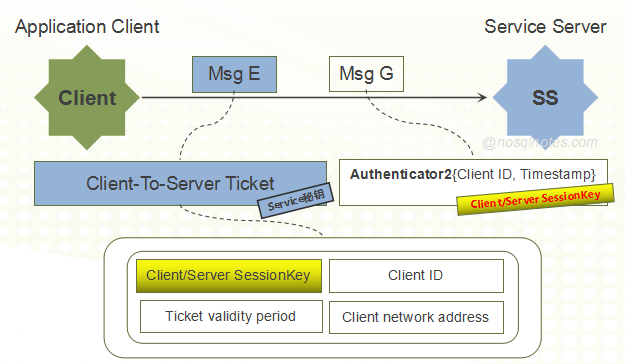

#Kerberos Protocol

Kerberos是一个常用的认证与授权协议，在初次接触该协议的时候，往往觉得该协议充满复杂的交互逻辑，但在充分理解了之后，又会觉得这过程中其实充满了数学与逻辑的美学。本文主要结合Wiki中关于Kerberos Protocol的定义，增加了一些图解信息，希望能够让读者更直观的理解该协议的内容。

## 整体流程

## 参与的关键角色

整体流程的介绍中，关于用户身份认证与服务授权都用“系统”这个抽象角色描述的。但实际上，用户身份认证与服务授权都是不同的服务角色提供的。参与的各方角色包括：

* Client:   Application Client 应用客户端
* AS:   Authentication Server  用来认证用户身份
* TGS:   Ticket-Granting Service 用来授权服务访问
* SS:   Service Server 用户所请求的服务

## 1. 用户登录

* 用户登录阶段，通常由用户输入**[用户名]**和**[密码]**信息。
* 在客户端侧，用户输入的**[密码]**信息被通过一个**单向Hash函数**生成一个**[Client密钥]**。

## 2. 请求身份认证

### 2.1 客户端向AS发送认证请求

* 客户端为执行登录操作的用户向**AS**发送**认证请求**
* 请求中带有**[用户名]**信息，用户名以明文形式发送到客户端。

> **Note**
>
> Client往AS发送认证请求时并未发送[密码]或[密钥]信息

### 2.2 AS确认Client端登录者用户身份 

1. AS收到用户认证请求之后，根据请求中的**[用户名]**信息，从数据库中查找该用户名是否存在。

2. 如果**[用户名]**存在，则对应的**[密码]**也可以从数据库中获取到。AS利用相同的单向Hash函数为[密码]生成一个密钥，如果第1步中用户提供的[密码]信息正确，该密钥与用户登录章节中的**[Client密钥]**相同。

3. AS为Client响应如下消息：

   * Msg A

     使用**[Client密钥]**加密的**[Client/TGS SessionKey]**

   * Msg B

     使用**[TGS密钥]**加密的**TGT(Ticket-Granting-Ticket)**，因此该消息Client不可解析。

     TGT中包含如下信息：

     * [Client/TGS SessionKey]
     * Client ID
     * Ticket有效时间
     * Client网络地址

4. Client收到AS的响应消息以后，利用自身的[Client密钥]可以对Msg A进行解密，这样可以获取到**[Client/TGS SessionKey]**。但由于Msg B是使用[TGS密钥]加密的，Client无法对其解密。

> **Note**
>
> 1. AS响应的消息中有一条是属于Client的，但另外一条却属于TGS。
> 2. 本文中提及的**加密**，如无特殊说明，均采用的是**对称加密算法**。

## 3. 请求服务授权

### 3.1 客户端向TGS发送请求服务授权请求

客户端发送的请求中包含如下两个消息：

* Msg C
  * 要请求的服务ID, 即**[Service ID]**
  * 上一步2.2中由AS为Client提供的**TGT**。
* Msg D
  * 使用**[Client/TGS SessionKey]**加密的Authenticator 1 {Client ID, Timestamp}。

###3.2 TGS为Client响应服务授权票据

TGS为Client响应的消息包括：

* Msg E

  使用**[Service密钥]**加密的Client-To-Server Ticket, 该Ticket中包含了如下信息:

  * **[Client/Server SessionKey]**
  * Client网络地址
  * Ticket有效时间
  * Client ID	

* Msg F

  使用**[Client/TGS SessionKey]**加密的**[Client/Server SessionKey]**。

Msg F使用了**[Client/TGS SessionKey]**加密，因此，该消息对Client可见。Client对其解密以后可获取到**[Client/Server SessionKey]**。

而Msg E使用了**[Service密钥]**加密，该消息可视作是TGS给Service Server的消息，只不过由Client一起携带。

## 4. 发送服务请求

### 4.1 Client向SS(Service Server)发送服务请求

发送的消息中包括：

* Msg E

  上一步3.2中，TGS为Client响应的消息Msg E。该消息可以理解为由Client为SS携带的消息。

* Msg G

  由**[Client/Server SessionKey]**加密的**Authenticator 2**，包含{Client ID, Timestamp}信息。

  这里的Authenticator 2区别于前面3.1步骤中的Authenticator 1。

> **Note**
>
> 1. **[Client/Server SessionKey]**并未直接透明传输，而是被包含在使用**[Service密钥]**加密的Msg E中。
> 2. 既然**[Client/Server SessionKey]**并不直接透明传输， Client需要向SS证明自己拥有正确的**[Client/Server SessionKey]**，所以，Authenticator 2使用了**[Client/Server SessionKey]**加密。

###  4.2 SS响应Client 

SS收到客户端的服务请求之后，先利用自身的**[Service密钥]**对Msg E进行解密，提取出Client-To-Server Ticket, 在3.2步骤中，提到了该Ticket中包含了**[Client/Server SessionKey]**以及Client ID信息。

SS使用**[Client/Server SessionKey]**解密Msg G，提取Client ID信息，而后将该Client ID与Client-To-Server Ticket中的Client ID进行比对，如果匹配则说明Client拥有正确的**[Client/Server SessionKey]**。

而后，SS向Client响应Msg H(包含使用**[Client/Server SessionKey]**加密的Timestamp信息)。

Client收到SS的响应消息Msg H之后，再使用**[Client/Server SessionKey]**对其解密，提取Timestamp信息，然后确认该信息与Client发送的Authenticator 2中的Timestamp信息一致。

如上信息可以看出来，该交互过程起到了Client与SS之间的**"双向认证"**作用。

*References*

1. https://en.wikipedia.org/wiki/Kerberos_(protocol)