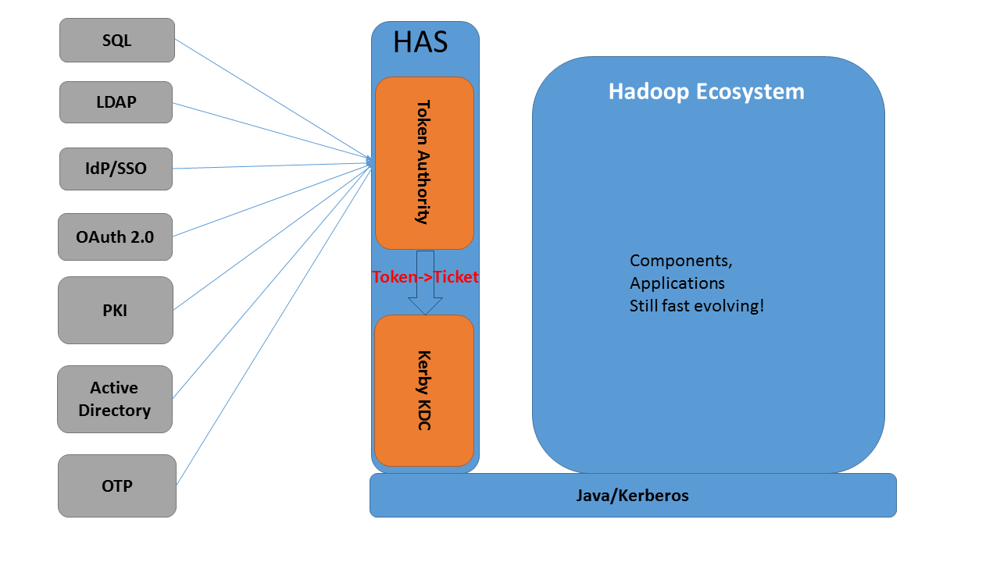
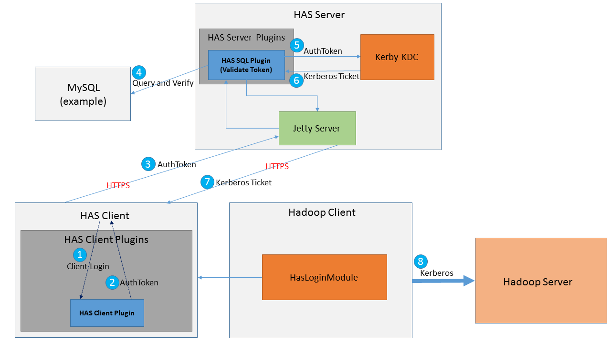

# 基于Kerby的Hadoop认证服务(HAS)

之前的文章[<Hadoop Token认证机制>](http://www.nosqlnotes.com/technotes/hadoop-tas/)中已经介绍了Hadoop的现有机制，Hadoop当前仅支持Kerberos认证，第三方身份认证服务难以接入Hadoop。这篇文章介绍另外一套基于Kerby实现的支持第三方身份认证服务的方案。

## Kerby项目介绍

如下是Apache Kerby项目的描述信息：

> Apache Kerby, as an Apache Directory sub project, is a Java Kerberos binding.

Kerby基于Java对Kerberos做了一些集成绑定，关键特性包括：

* 集成Kerberos, PKI以及OAuth2 Token
* 与KDC服务器交互的Client API(包括应用可感知的获取TGT或Service Ticket的接口)
* 基于Java实现了一个可嵌入或独立的KDC Server
* 提供对JAAS, GSS-API和SASL框架的支持
* 可通过插件支持第三方身份认证服务
* ......

从上述特性可以看出来，Java应用基于Kerby可以做更丰富的一些交互了。例如，在没有Kerby之前，TGT与Service Ticket的获取对应用都是透明无感知的，同时，能够更好的支持第三方的身份认证服务。

更多信息，请直接参考Apache Kerby项目。

## 方案思路



### 核心思路

 1.  **Token换取Ticket** 

     基于第三方身份认证服务获取的Token，去Kerby KDC中换取Kerberos Ticket

	2. **基于Ticket访问Hadoop**

    Hadoop现有认证接口不需要做任何改变

### 插件机制

HAS提供了第三方身份认证服务的插件机制，应用可以定制Client端Login以及Server端Authentication的实现。

* HasClientPlugin中定义了Client端login的接口：

```java
// Get the login module type ID, used to distinguish this module from others. 
// Should correspond to the server side module.
String getLoginType()

// Perform all the client side login logics, the results wrapped in an AuthToken, 
// will be validated by HAS server.
AuthToken login(Conf loginConf) throws HasLoginException
```

* HasServerPlugin中定义了Server端对Token进行认证的接口:

```java
// Get the login module type ID, used to distinguish this module from others. 
// Should correspond to the client side module.
String getLoginType()

// Perform all the server side authentication logics, the results wrapped in an AuthToken, 
// will be used to exchange a Kerberos ticket.
AuthToken authenticate(AuthToken userToken) throws HasAuthenException
```

### 一个例子



1. Hadoop Client通过定制的HasClientPlugin进行 Login操作。
2. HasClientPlugin为Client返回一个AuthToken。
3. Client基于AuthToken去访问Has Server。
4. 定制的HasServerPlugin插件可以去第三方身份认证服务中校验AuthToken的有效性。
5. AuthToken校验成功之后，可基于该AuthToken去Kerby KDC中请求对应的Ticket。
6. Kerby KDC为HasServerPlugin返回对应的Kerberos Ticket。
7. Hadoop通过AuthToken成功获取到Ticket。
8. Hadoop基于Ticket去访问Hadoop Server。

## 总结

该方案基于Kerby实现了利用**第三方用户身份Token**换取**Kerberos Ticket**的方案，可以说，在不改动任何Hadoop源码的情况下，让Hadoop间接支持了第三方身份认证服务，但该方案需要额外引入Kerby服务。对于Hadoop而言，依然算不上是一个终极解决方案。

注: 本文中的图均源自Apache directory-kerby项目

*References*

1. https://github.com/apache/directory-kerby
2. https://github.com/apache/directory-kerby/tree/has-project/has