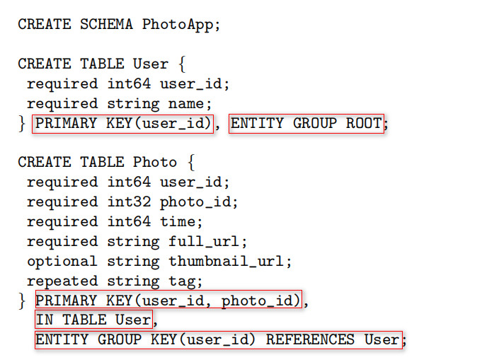
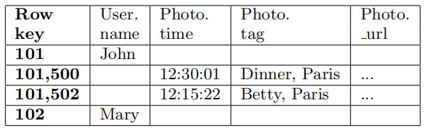
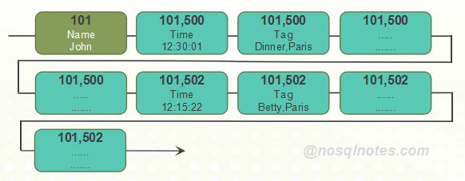

# MegaStore的级联数据模型

本文继[<MegaStore有哪些值得借鉴的设计>](http://www.nosqlnotes.com/techpoints/megastore-key-designs/)之后，深度探讨一下MegaStore所提供的一种级联的数据模型，如果熟悉Oracle Table Cluster的原理，对于该模型所能带来的有益效果并不陌生。而在此后的Spanner/F1的数据模型中，也采用了该设计，可见该模型在Google内部拥有广泛的适用场景。

##如何建表

先看一下MegaStore论文中如何建表的语法：

图1: 建表语法

先创建一个**User**表，包含{**user_id**, name}两个字段，指定了如下两点关键信息：

* user_id作为主键
* User表作为一个**Entity Group**的Root表

而后，创建**Photo**表，包含{**user_id**, photo_id, time, full_url, thumbnail_url, tag}共6个字段。另外，建表语句中还定义了：

* {user_id + photo_id}作为主键
* Photo表位于User表中，作为Entity Group的Child表
* 作为Entity Group的Child表的Photo表，与作为Entity Group Root表的User表通过**user_id**字段关联

## 数据视图

下图可以直观的看出来这种级联结构的数据视图：

图2: 级联模型数据视图，源自MegaStore论文

上图包含了两点关键信息：

* User表与Photo表事实上是位于同一个Bigtable表中
* 相同**user_id**所关联的User表及Photo表中的数据，是逻辑相邻(也可能是物理相邻)的，如上图中**user_id**为101的3行相关数据

## 原理分析

MegaStore基于Bigtable作为底层的数据存储系统：Bigtable基于Schema-less的设计，一个用户表并不需要定义严格的Schema，而MegaStore却提供了严格的Schema定义。也就是说，MegaStore基于Bigtable的无Schema的表基础上，定义了Schema信息，MegaStore的表更像是一种逻辑表，而Bigtable的表才是真正的物理表。

从前面章节提供的表定义信息来看，User表中仅有{**user_id**, name}两个字段。而上一章节图2提供的数据视图中，User表中user_id为101的行中似乎有4个列，只是Photo.time, Photo.tag以及Photo_url等列为空。事实上，基于Bigtable稀疏表的设计，每一列均以Key-Value的形式存在，以Key-Value组织的数据视图如下所示：

图3：级联模型的Key-Value视图

也就是说，图2中的"空列"本身在Bigtable表中并不存在，不占用任何空间。这里就充分利用了Bigtable的Schema-less的稀疏表特点：**表没有预先的Schema定义，所以每一行列的数量以及列名的定义都可以是灵活的**。尽管MegaStore定义了严格的Schema信息，但可以将存在两个存在关联的逻辑表，存放于一个相同的物理表中，只不过，User表的行与Photo表的行各自有各自的Key和列定义。

既然User表与Photo表的数据可以存放于一个相同的表中，而且两个表的主键的第一个字段均为**user_id**字段（拥有**相同的前缀字段**），依据**Bigtable表的数据按照RowKey的字典顺序存放**的原则，相同**user_id**的源自User表以及Photo表中的多行数据，自然在逻辑顺序上是相邻的，至于物理上是否相邻，取决于位于Memtable以及多个SSTable文件中的数据是否做了合并。

简单总结一下，将两个MegaStore的逻辑用户表存放于一个Bigtable的物理表中，主要还是依据了Bigtable的两点关键设计：

* Schema-less的稀疏表结构设计
* 数据按照RowKey的字典顺序存放

##级联模型的优势

众所周知，NoSQL系统的多表关联查询是非常复杂的，这种级联模型可以说提供了一种崭新的多表关联查询思路，可以将以实体为中心的多类数据（也可以是维度表与事实表之间），通过使用关联字段作为相同的RowKey前缀，使得这些数据能够在同一个物理表中相邻存放，这样，将多表关联查询转换为了Bigtable所擅长的顺序Scan查询，可以使得性能与查询并发度大幅提升。

*References*

1. Megastore: Providing Scalable, Highly Available Storage for Interactive Services
2. [MegaStore有哪些值得借鉴的设计](http://www.nosqlnotes.com/techpoints/megastore-key-designs/)

本文源自：[NoSQL Notes](http://www.nosqlnotes.com/)
永久链接：http://www.nosqlnotes.com/techpoints/megastore-key-designs/
除非特别注明，本站文章均为原创，转载请注明出处和链接。