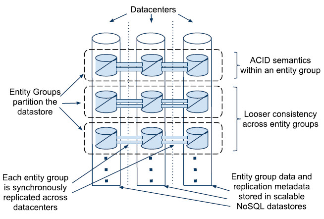

## 理解MegaStore的Entity Group

前一篇文章[《MegaStore的级联数据模型》](http://www.nosqlnotes.com/technotes/megastore-datamodel/)已经简单提及了Entity Group的概念，本文结合论文中列举的几个划分Entity Group的例子来加深对该概念的理解，最后再讨论这种设计所能带来的一些好处。

**Entity Group**是为了加速读写操作而定义的一种数据分组方法。如下是论文中的定义：

> The entity group defines the a priori grouping of data for fast operations. 

为了更好的理解**Entity Group**的概念，论文中同样给出了几个划分**Entity Group**的例子：

- **Email**

  每一个Email账户的相关数据可以作为一个Entity Group。

- **Blogs**

  对于一个博客系统，可能涉及到多种不同维度/类型的Entity Group：

  **User维度**： 每一个User相关的基础数据可以作为一个Entity Group。

  **Blog维度**： 每一个博客中可能涉及到多篇文章以及元数据信息，这些数据可以一起组成一个Entity Group。

  **Post维度**：  每一篇文章的维度也可以作为细分的Entity Group，因为每一篇文章也可能涉及到评论，修改记录等数据。

前面的文章中已经提到， MegaStore是构架在Bigtable之上的。Bigtable的架构决定了它仅能支持**简单的非关系型数据模型**，所以，两类典型的适用场景为：

* Entity-Centric Data 	

  以某种实体为中心的数据，如人，账户，Email地址，车辆等等。

* Event-Centric Data       

  以某类事件为中心的数据，如监控数据，日志数据等等。

这两类数据都满足了**"数据模型简单"**的特点，无论是TB还是PB级别，Bigtable都可轻松支持。然而，MegaStore想要做的是要补齐Bigtable在**跨行事务**、**多表关联查询**以及在**服务可用性**上的短板，Entity Group的设计可以说提供了良好的基础：

* 同一个Entity Group的数据可以被划分到Bigtable表的同一个数据分区中(Tablet)，这样，同一个Entity Group内的跨行事务是可以轻松支持的。

* 同一个Entity Group中的数据是相邻存放的，这样可以将多表的关联查询转换为一个顺序的Scan，加速查询。同时，对于数据写入而言，同一个Entity Group中的多条数据在一起写入时，也可有效的降低随机IO数目来提升写入性能。

* 跨集群数据复制时，一个Entity Group在不同的集群间的数据可保持ACID语义的:是

  Entity Group可以理解为是比Bigtable Tablet更细粒度的分区，更细粒度意味着并发锁的范围更小，从而可以带来更高的并发度。

  ​

