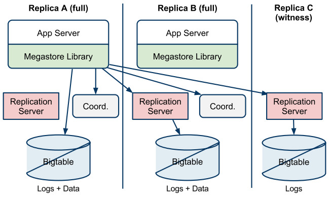
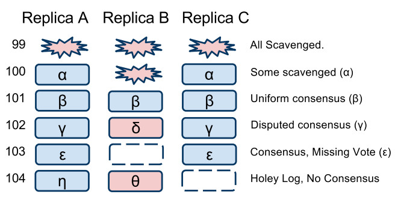

# Megastore的同步容灾机制-2

## 同步容灾架构

* 应用通过直接调用Client Library访问Megastore中的数据
* Client Library中实现了Paxos算法，还包括选择读取的Replica，追赶数据等等 
* 每一个Application都有一个指定的Local Replica(本地副本), Client Library确保基于Paxos的写入操作，一定会持久化本地副本的数据，即写入到本地的Bigtable集群中
* Client Library将数据发往远端Replica时，是通过一个**Replication Server**的中介角色完成的，由**Replication Server**负责往对应的Bigtable集群中写入数据
* Replicaion Server通过定期的扫描操作来协助补齐相关缺失的数据
* 上图中的Replica C是一个Witness Replica，当Replica A或者Replica B其中一个无法正常服务时，Replica C可协助实现Paxos写入操作的Quorum Consistency

## 数据结构与算法

### Replication Logs

每一个Replica中保存了如下两类数据：

* Mutations
* Megadata

每一个Replica允许接收乱序的Proposals，这样即使一个刚刚从故障中恢复的Replica也可以参与到Write Quorum中。每一个Log Entry在Bigtable中都存成了独立的KeyValue，因为每一个KeyValue都携带有自身的Timestamp信息，这样，即使数据接受的时间与数据自身的时间是乱序的，但数据在被Compaction合并时或者是读取时，依然是按照数据自身的Timestamp进行排序的，这里利用了Bigtable的特性。

如果一个Replica中缺失了某些日志数据，则该Replica称之为有Hole。如下图中的103数据，在Replica B中就缺失了：

### Reads

如果要读取最新的数据（Current Read），那么至少得有一个Replica中的数据必须是完整的且最新的，也就是说，所有的已经被Commit的Log中的数据都需要被Apply到该Replica中，从数据缺失到补齐完整数据的过程，称之为**数据追赶**。关于Current Read的流程：

1. 如果Local Replica中的数据已经是最新的，至于Local Replica中的数据状态，可以从Coordinator中获取到。

2. 获取已Commit的最大的Log Position，而后基于该Log Position选择最合适的副本：

   如果第1步中Local Replica的数据是最新的，则直接读取Local Replica中已接收的最大的**Log Position**以及**Timestamp**信息。

   如果Local Replica中的数据不是最新的，则从大多数副本中获取已被接收的最大的Log Position信息以及**Timestamp**信息，然后选择一个<u>通常能快速响应的Replica</u>或者是<u>数据最新的Replica</u>。

3. 进行数据追赶，需要补齐所有的缺失的数据。

4. 如果Local Replica被选中了，而且Local Replica的数据并不是最新的，这个时候需要给Coordinator发送一个validate信息来确认要读取的Entity Group在该Replica中的数据是完整的。

5. 基于第2步获取到的Timestamp信息开始读取数据。如果读取过程中，所选择的Replica变得不可用了，则需要重新更换一个Replica，然后同样需要执行数据追赶操作。对于一个涉及到大量数据的读取操作，可能由多个Replicas的读取操作一起完成的，但该过程对应用透明。

由此可以看出，如果被选择的Replica的数据有缺失的话，真正执行读取之前的数据追赶动作，可能使得读取的时延变得不可控。但好在大多数场景下，均能获取到一个数据完整的且最新的副本。

