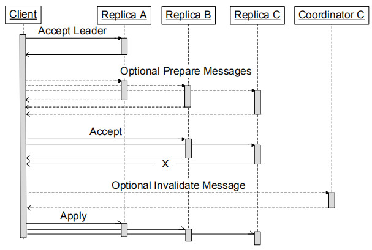

# Megastore的同步容灾机制3

Megastore第一次在大规模用户数据的多副本同步机制中采用了Paxos算法，已经是一个非常大的尝试，但原始的Paxos算法虽然从数学证明上是无懈可击的，但真正在一个高吞吐量的集群中应用时，还需要一些工程实现上的优化。这篇文章主要介绍Megastore基于Paxos算法的Write流程，作为Megastore同步容灾机制的完结篇。

### Writes

回顾一下第一篇文章《Megastore的同步容灾机制1》中提到的`Fast Writes`机制：

> Megastore为了减少Paxos Write的网络交互次数，采用了一种Leader的机制，这样可以在持续的写入时，可以将Paxos Write Prepare阶段的网络交互给省掉了。

在完成一次读取操作后，Megastore已经获知了如下信息：

- 下一个未使用的Log Position
- 最后一次写入操作的Timestamp
- 下一次写入的Leader Replica

当执行Commit操作时，如下信息被打包后作为下一个Log Position的建议值（Proposed Value）:

- 状态变更数据
- Timestamp
- 建议的Leader Replica

如果该建议值在所有的副本中达成了一致，则这些状态变更数据将会被Apply到每一个副本中。

如果失败，则整个事务将会被放弃，或者不断的执行重试。

Coordinators中记录了所有的数据最新(up-to-data)的Entity Groups。如果一个Write操作没有在一个Entity Group的所有的副本中写成功，则需要将该Entity Group的ID从Coordinators中移除掉，这个过程在Megastore中称之为`invalidation`。一个Write操作如果被认定为`committed`状态并且准备`apply`到每一个副本中之前，必须已经完成如下**两个动作之一**：

- 该write已经被所有的Replica中`accept`了
- 如果对应的Entity Group ID已经从Coordinators中移除，即被`invalidation`了

Megastore Paxos Write的流程如下：

1. **Accept Leader** 

   询问Leader去`accept`对应的建议值，`Proposal Number`为0（Paxos算法中每一次由Proposer向Acceptors发送建议值`Proposed Value`时，都携带有一个`Prososal Number`）。这一步就是`fast write`的实现。

   如果成功，直接到下面第3步

2. **Prepare**

   Paxos Prepare阶段，在该阶段，Proposer希望通过一个更大的`Proposal Number`来获得尽可能多的Replicas的承诺从而获得Value的建议权。

3. **Accept**

   让除了Leader之外的Replicas去`accept`对应的建议值(`Proposed Value`)。

4. **Invalidate**

   如果一个Entity Group的至少一个Replicas未`accept`对应的Value,则需要将该`Entity Group`从`Coordinator`中移除。

5. **Apply**

   将对应的`Value`的改动信息`apply`到尽可能多的Replicas中。如果最终被选定的`Value`与最初建议的`Value`不同，则返回写入冲突错误。

在RDBMS中，`commit point`与`visibility point`是相同的，也就是说，一条被`commit`的记录，对于接下来的读取是利马可见的。但在Megastore的写入算法中，`commit point`位于上述第3步之后就确定了,但`visibility point`却是在第4步之后的。这很容易理解，因为要保证在《Megastore的同步容灾机制1》中提到`current read`的读取语义，只要是位于`Coordinator`中的数据，都必须确保是`up-to-date`的。

## 总结

Megastore基于Paxos算法实现了跨集群的同步容灾能力，这应该是Paxos算法用于海量用户数据存储多副本共识机制的第一次应用。Megastore在实现Paxos算法时，为了尽可能的降低网络交互并且提升吞吐量，采用了一种Leader机制。而在优化读取时，尽可能的从本地副本中进行读取，为了确保本地副本中的数据是最新的，需要利用Coordinators来实时跟踪每一个Entity Group的数据状态。

Megastore的Paxos算法是在Entity Group级别实现的，当多个应用往同一个Entity Group提交写入请求时，可能存在写入竞争，Megastore建议用户应该采用一种合理的Entity Group的划分粒度，以及尽可能的采用Batch Write的机制。总体来看，Megastore的确做了不少崭新的尝试，虽然这些尝试在今天看来已司空见惯。从后来Spanner论文中所披露的信息来看，Megastore的吞吐量是Google内部用户的最大槽点。