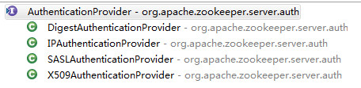

# ZooKeeper Security-1

ZooKeeper的Client-Server互认证机制是从3.4.0版本开始引入的，本文主要介绍znodes的ACL的定义，任务服务接口定义与几种已有的认证服务实现，以及ACL与多种认证服务是如何建立联系的。本文内容基于ZooKeeper 3.5.1版本。

## ACL

ZooKeeper的ACL可针对`znodes`设置相应的权限信息，ACL数据的表示格式为：`schema:id:permissions`

* **schema** 

  支持的几种**schema**为：

  * **world**

  只有一个名为`anyone`的`Id`, `world:anyone`代表任何人，也就是说，对应节点任何人可访问

  * **auth**

  代表任何通过认证的用户，该**schema**不需要配置`Id`信息

  * **digest**

  基于`username:password`生成的MD5 Hash值作为`Id`信息，认证基于`username:password`明文认证，但在acl中存储的是`username:base64(password)`

  * **ip**

  基于IP地址作为`Id`，支持IP地址或IP地址段

* **id**

  代表用户

* **permissions**

  权限定义为**(READ, WRITE, CREATE, DELETE, ADMIN, ALL)**

由ACL的定义信息，可以看出来，ZooKeeper可以针对不同的`znodes`来提供不同的认证机制。

##AuthenticationProvider

每一种认证服务均需要实现`AuthenticationProvider`接口来支持一种新的**schema**，所有的`AuthenticationProvider`实现类都被注册在`ProviderRegistry`中。ZooKeeper中已经提供的AuthenticationProvider`的实现类：

每一个`AuthenticationProvider`实现类所关联的`schema`如下所示：

| AuthenticationProvider实现类    | schema |
| ---------------------------- | ------ |
| DigestAuthenticationProvider | digest |
| IPAuthenticationProvider     | ip     |
| SASLAuthenticationProvider   | sasl   |
| X509AuthenticationProvider   | x509   |

当znode acl schema为`world`时，是不需要经任何`AuthenticationProvider`进行认证的，因此不需要任何实现类。

当znode acl schema为`auth`时，代表着需要对请求上下文中的认证信息进行校验，在`ServerCnxn`的`authInfo`中保存了所有的已认证成功的`Id`以及认证服务所关联的的`schema`，由该`schema`再去`ProviderRegistry`中查找所关联的`AuthenticationProvider`实现类来对认证信息进行校验。

除了上述已有的实现者以外，用户还可以自定义实现`AuthenticationProvider`。自定义的实现类，需要设置到System Properties中，对应的`Property Key`需以`"zookeeper.authProvider."`开头。另外，自定义的`AuthenticationProvider`的`schema`名称不应与现有的重名，否则会覆盖现有的实现。

*Reference*

1. [Client-Server Mutual Authentication](https://cwiki.apache.org/confluence/display/ZOOKEEPER/Client-Server+mutual+authentication)
2. [ZOOKEEPER-938](https://issues.apache.org/jira/browse/ZOOKEEPER-938)