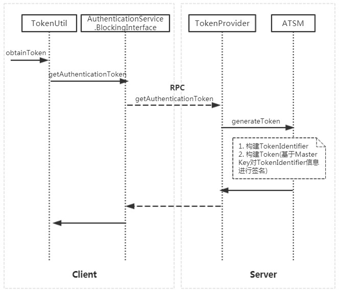

#HBase Token机制

[TOC]

HBase Token方案被应用于MapReduce任务中Map/Reduce Task的认证，这样可以显著降低KDC端的认证压力，该能力并未直接对外开放，它的设计遵循了《Hadoop Security Design》中的Token方案。本文基于HBase 2.0版本的源码，简单讨论一些实现原理。

## 接口定义

Authentication.proto文件中提供了获取Token的Service方法定义：

```protobuf
// RPC service
service AuthenticationService {
    rpc GetAuthenticationToken(GetAuthenticationTokenRequest)
        returns (GetAuthenticationTokenResponse);

    rpc WhoAmI(WhoAmIRequest)
        returns (WhoAmIResponse);
}
```

基于上述proto定义文件生成的Java文件名为AuthenticationProtos.java，里面自动生成了两个接口类：

* **AuthenticationService.Interface**

  提供了异步RPC服务请求的接口定义：

  ```java
  public interface Interface {
    public abstract void getAuthenticationToken(
      RpcController controller,
      GetAuthenticationTokenRequest request,
      GetAuthenticationTokenResponse> done);

    public abstract void whoAmI(
      RpcController controller,
      WhoAmIRequest request,
      WhoAmIResponse> done);
  }
  ```

* **AuthenticationService.BlockingInterface**

  提供了同步RPC服务请求的接口定义：

  ```java
  public interface BlockingInterface {
    public GetAuthenticationTokenResponse getAuthenticationToken(
      RpcController controller,
      GetAuthenticationTokenRequest request)
      throws ServiceException;

    public WhoAmIResponse whoAmI(
      RpcController controller,
      WhoAmIRequest request)
      throws ServiceException;
  }
  ```


##服务端Token实现框架

### Token

HBase直接采用了hadoop-common中定义的Token，一个 Token中包含如下关键信息：

```java
// TokenIdentifier的序列化信息
private byte[] identifier;
// password是利用Master Key签名AuthenticationTokenIdentifier
// 信息生成的消息验证码.
private byte[] password;
// 对于HBase Token而言，kind为"HBASE_AUTH_TOKEN"
private Text kind;
// 在HBase中, service名称为HBase Cluster ID.
private Text service;
private TokenRenewer renewer;
```

###AuthenticationTokenIdentifier

AuthenticationTokenIdentifier定义了与一个新生成的Token所涉及的信息，如{用户名，Master Key ID, 发布时间，过期时间，序列号}，源码如下：

```java
// Token所关联的用户名
protected String username;
// 关联当前正在使用的Master Key的数字类型ID
protected int keyId;
// Token发布时间
protected long issueDate;
// Token过期时间
protected long expirationDate;
// Token序列号
protected long sequenceNumber;
```

###Master Key

**Master Key**是用于签名Token的密钥，在本文范畴内，遵循Hadoop Security Design中的定义，将其称之为Master Key。Master Key是AuthencationKey的实例，源码定义如下：

```java
private int id;
private long expirationDate;
private SecretKey secret;
```

###AuthenticationTokenSecretManager

Master Key的管理，是由**AuthenticationTokenSecretManager**实现的，该类继承自hadoop-common中的**SecretManager**。为了便于阐述，在本文范围内将AuthenticationTokenSecretManager缩写为**ATSM**。

任意时刻，只有一个正在使用的Master Key，所有新生成的Token都基于该Master Key签名，Master Key会被周期更新。ATSM在RegionServer RpcServer启动时被创建，但在一个HBase集群中，只有一个AuthenticationTokenSecretManager作为**Leader**, 其它的均为Follower。Leader有两个方面的关键职责：

* Master Key定期更新

  更新后的Master Key通过ZooKeeper的节点事件通知机制知会其它的Followers

* 过期Master Key的销毁

  一个过期的Master Key，意味着所有基于该密钥签名的Tokens都已经过期了

ATSM中保存有效Master Key列表以及最新正在使用的Master Key的相关源码：

```java
// 存放所有的有效Master Key
private Map<Integer,AuthenticationKey> allKeys = new ConcurrentHashMap<>();
// 当前正在使用的Master Key
private AuthenticationKey currentKey;
```

###TokenProvider

TokenProvider提供了接口类AuthenticationProtos.AuthenticationService.Interface的实现，该类是服务端创建Token的直接入口，但实质的Token创建动作由ATSM完成。

## 请求Token的流程



1. Client端通过TokenUtil中提供的obtainToken接口请求Token
2. TokenUtil#obtainToken基于AuthenticationProtos中定义的接口进行同步RPC方法调用
3. RegionServer侧由TokenProvider直接处理获取Token的请求，Token的生成交由ATSM完成

##源码实现细节

该章节将HBase Token涉及到的关键源码尽可能的按调用的顺序给呈现出来，并添加了必要的一些备注信息，供参考。

### RpcServer初始化

SimpleRpcServer初始化时创建ATSM对象：

```java
public synchronized void start() {
  if (started) return;
  // 创建ATSM对象.
  // 实现细节请参考下一章节"创建ATSM"
  authTokenSecretMgr = createSecretManager();
  if (authTokenSecretMgr != null) {
    setSecretManager(authTokenSecretMgr);
    authTokenSecretMgr.start();
  }
  this.authManager = new ServiceAuthorizationManager();
  HBasePolicyProvider.init(conf, authManager);
  responder.start();
  listener.start();
  scheduler.start();
  started = true;
}
```

### 创建ATSM

```java
protected AuthenticationTokenSecretManager createSecretManager() {
  if (!isSecurityEnabled) return null;
  if (server == null) return null;
  Configuration conf = server.getConfiguration();
  // Master Key的更新周期
  long keyUpdateInterval =
    conf.getLong("hbase.auth.key.update.interval", 24*60*60*1000);
  // Token的最大存活时间
  long maxAge =
    conf.getLong("hbase.auth.token.max.lifetime", 7*24*60*60*1000);
  return new AuthenticationTokenSecretManager(conf, server.getZooKeeper(),
                                              server.getServerName().toString(), 
                                              keyUpdateInterval, maxAge);
}
```

###Master Key的定期更新

Leader中密钥的定期更新，是通过一个LeaderElector线程来完成的：

```java
public void run() {
  zkLeader.start();
  // 等待成为Leader
  zkLeader.waitToBecomeLeader();
  isMaster = true;

  while (!stopped) {
    long now = EnvironmentEdgeManager.currentTime();

    // 清理过期的Keys
    removeExpiredKeys();
    long localLastKeyUpdate = getLastKeyUpdate();
    // 检查是否到了更新密钥(Master Key)的周期时间点
    if (localLastKeyUpdate + keyUpdateInterval < now) {
      // 更新一个新的密钥(Master Key)
      // 实现细节请参考下一章节"更新Master Key细节"
      rollCurrentKey();
    }

    try {
      Thread.sleep(5000);
    } catch (InterruptedException ie) {
      if (LOG.isDebugEnabled()) {
        LOG.debug("Interrupted waiting for next update", ie);
      }
    }
  }
}
```

###更新Master Key的细节

```java
synchronized void rollCurrentKey() {
  if (!leaderElector.isMaster()) {
    LOG.info("Skipping rollCurrentKey() because not running as master.");
    return;
  }

  long now = EnvironmentEdgeManager.currentTime();
  AuthenticationKey prev = currentKey;
  // 初始创建一个AuthenticationKey时并不需要设置Token的过期时间.
  // 只有当被新的AuthenticdationKey替代时，才会被设置.
  AuthenticationKey newKey = new AuthenticationKey(++idSeq,
       Long.MAX_VALUE, // don't allow to expire until it's replaced by a new key
       generateSecret());
  allKeys.put(newKey.getKeyId(), newKey);
  currentKey = newKey;
  zkWatcher.addKeyToZK(newKey);
  lastKeyUpdate = now;

  if (prev != null) {
    // 设置前一个Key的过期时间，这里设置的过期时间考虑了Token的最大过期时间, 这是
    // 为了防止正在被使用的Token无法被校验合法性.
    prev.setExpiration(now + tokenMaxLifetime);
    allKeys.put(prev.getKeyId(), prev);
    zkWatcher.updateKeyInZK(prev);
  }
}
```

### 通过TokenProvider获取Token

TokenProvider#getAuthentiationToken的方法实现：

```java
@Override
public void getAuthenticationToken(RpcController controller,
      AuthenticationProtos.GetAuthenticationTokenRequest request,
      RpcCallback<AuthenticationProtos.GetAuthenticationTokenResponse> done) {
    AuthenticationProtos.GetAuthenticationTokenResponse.Builder response =
        AuthenticationProtos.GetAuthenticationTokenResponse.newBuilder();

    try {
      if (secretManager == null) {
        throw new IOException(
            "No secret manager configured for token authentication");
      }

      // 获取请求上下文中的User
      User currentUser = RpcServer.getRequestUser();
      UserGroupInformation ugi = null;
      if (currentUser != null) {
        ugi = currentUser.getUGI();
      }
      // ....略去一些非核心代码....
      
      // 由ATSM负责为请求上下文的用户生成Token
      // 实现细节请参考下一章节"ATSM生成Token"
      Token<AuthenticationTokenIdentifier> token =
          secretManager.generateToken(currentUser.getName());
      response.setToken(TokenUtil.toToken(token)).build();
    } catch (IOException ioe) {
      CoprocessorRpcUtils.setControllerException(controller, ioe);
    }
    done.run(response.build());
}
```

###ATSM生成Token

```java
public Token<AuthenticationTokenIdentifier> generateToken(String username) {
  // 构建AuthenticationTokenIdentifier对象实例
  AuthenticationTokenIdentifier ident =
  new AuthenticationTokenIdentifier(username);
  // 构建Token对象实例
  // 实现细节请参考下一章节"Token初始化"
  Token<AuthenticationTokenIdentifier> token = new Token<>(ident, this);
  if (clusterId.hasId()) {
    // 为Token设置Service信息.
    token.setService(new Text(clusterId.getId()));
  }
  return token;
}
```

###Token初始化

```java
public Token(T id, SecretManager<T> mgr) {
  // 基于AuthenticationTokenIdentifier生成password信息.
  // 实现细节请参考下一章节"ATSM#createPassword细节"
  password = mgr.createPassword(id);
  identifier = id.getBytes();
  kind = id.getKind();
  service = new Text();
}
```

###ATSM#createPassword细节

```java
protected synchronized byte[] createPassword(AuthenticationTokenIdentifier identifier) {
  long now = EnvironmentEdgeManager.currentTime();
  AuthenticationKey secretKey = currentKey;
  // 设置Key ID
  identifier.setKeyId(secretKey.getKeyId());
  // 设置Token发布时间
  identifier.setIssueDate(now);
  // 设置Token过期时间
  identifier.setExpirationDate(now + tokenMaxLifetime);
  // 设置Token序列号
  identifier.setSequenceNumber(tokenSeq.getAndIncrement());
  // 基于Master Key对AuthenticationTokenIdentifier进行签名
  return createPassword(identifier.getBytes(),
                        secretKey.getKey());
}
```

