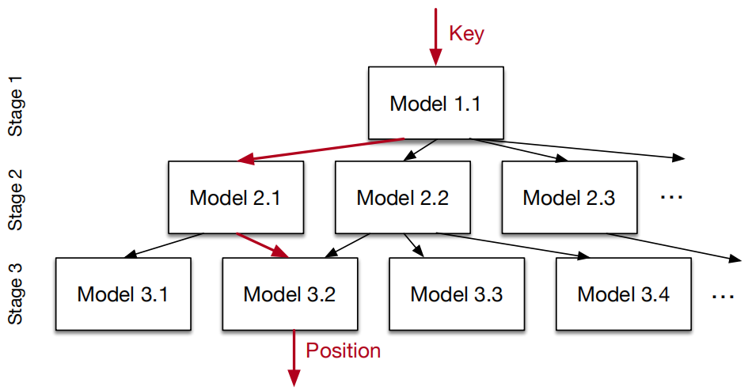
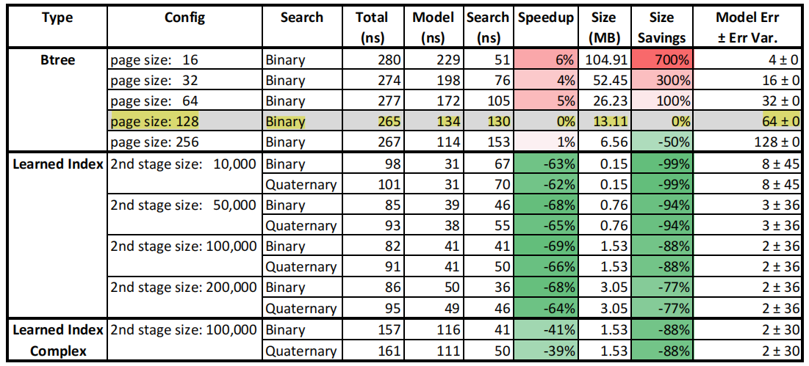

# Learned Index对传统索引的改造

这篇论文在两个月前刚被公布出来的时候，因为带着Jeff Dean的署名曾一度被热传，但直到今天才认真读完这篇论文。Learned Index基于机器学习的方法，对传统数据库索引做了改进。本文先介绍Learned Index的RM-Index模型以及与B-Tree索引的对比。

如论文开篇所言，可以将传统的数据库**索引(Index)**视为一种**模型(Model)**：

* **B-Tree索引**

  B-Tree索引模型将一个Key映射到一个排序数组中的某位置所对应的记录

* **Hash索引**

  Hash索引模型将一个Key映射到一个无序数组中的某位置所对应的记录

* **Bitmap索引**

  Bitmap索引模型用来判断一条记录是否存在

> **Indexes are models**: a **B-Tree-Index** can be seen as a model to map a key to the position of a record
> within a sorted array, a **Hash-Index** as a model to map a key to a position of a record within an unsorted array, and a **BitMap-Index** as a model to indicate if a data record exists or not.

索引常被用来加速数据库查询，过去关于索引的优化，常常聚焦于如下几点：

* 如何基于业务的查询模型构建最合理的索引
* 如何在查询中选择最佳的索引

关于索引的相关理论或优秀实践，早在RDBMS时代，就几乎已被发掘殆尽，在大数据时代，也只是在反复的借鉴过去的这些经验，在理论方面却鲜有创新。

但这些传统索引却存在一个最显著的问题：**它们没有考虑数据的分布特点，往往预先假设了最差的数据分布，从而期望索引具备更高的通用性**。因此，这些索引往往会导致大量的存储空间浪费，而且性能无法达到极致。

Learned Index正是借助机器学习的方法，通过对存量数据进行学习来掌握这些数据的分布特点，从而可以对现有的索引模型进行改进。基于真实数据集的测试效果来看，Learned Index较之传统的B-Tree Index，**有60%~70%的性能提升，在存储空间上甚至可以节省99%**。本文重点讨论Learned Index针对这三种索引所做的改进。

## B-Tree索引(Range Index)

B-Tree中通常按照Page来组织数据，每一个Page对应B-Tree中的一个节点。基于一个Key进行查询时，事实上是先通过非叶子节点的索引信息，查找到一个目标Page，可以将这个过程理解为：基于B-Tree Index模型，对一个给定Key值所在的数据位置做了"预测"。Learned Index要对B-Tree Index所做的改造，希望能够做到**更快速的预测**，误差率要在可控的范围内：

> Given a key, the model makes a prediction about the position where to find the data; if the key
> exists, it is guaranteed to be in the range of the prediction defined by the min- and max-error. C

Learned Index采用了一种称之为Recursive Model Index(缩写为RM-Index)的索引来替代B-Tree Index，思路如下：

RM-Index采用了一种**递归回归模型**，将整个预测过程划分成多个Stage，每一个Stage的Model基于Key作为Input，然后选择下一个Stage所对应的Model，依次递归，直到最终的一个Stage能够预测出Key的数据位置（在限定的误差范围内）...这个模型有如下几点优势：

* 它充分考虑了数据的全局分布
* 每一步迭代都将预测空间划分成了更小的子区间，类似于B-Tree或决策树的思路，从而通过有限几步迭代就可锁定最终的数据位置
* 迭代过程中没有任何数据搜索操作

当然，还可以采用一种混合索引模型：

* 高层模型可以采用神经网络
* 底层可以采用一个简单的线性回归模型，甚至可以直接使用B-Tree索引

混合索引模型可以有效确保RM-Index在最坏情况下的性能也不会弱于B-Tree索引。

如下是基于Maps Data(论文中采用的其中一种真实数据集)，采用RM-Index与B-Tree索引的对比测试结果：

测试将基于Key的查询分为两个阶段： 

1. **Model**

   基于模型对指定Key所关联数据位置的预测

2. **Search**

   在叶子节点所关联的数据Page中查找Key的实际位置

从测试结果可以看出来：**性能有60%~70%的提升，而在存储空间占用上最高节省了99%**。 因为RM-Index采用了神经网络模型，所以在数据压缩上可以发挥更大的潜力。

## Hash索引(Point Index)

## Bitmap索引(Existence Index)

