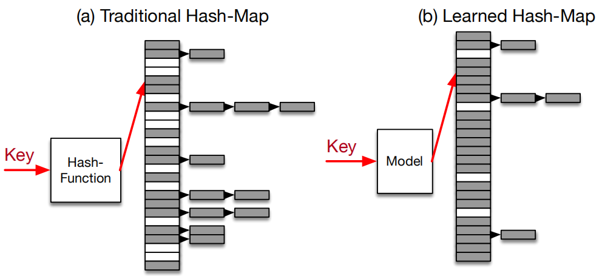
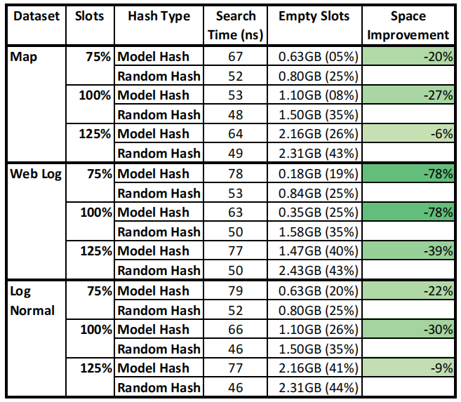
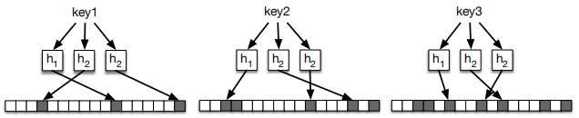

Learned Index学习笔记

这篇名为《The Case for Learned Index Structures》在两个月前刚刚被发布出来的时候，因为带着Jeff Dean的署名曾一度被热传，但遗憾直到现在才认真读完这篇论文。Learned Index与数据库传统索引的对比，好比是RDBMS中的CBO与RBO的对比，本文先介绍Learned Index对B-Tree索引的改造。

这篇论文在两个月前刚被公布出来的时候，因为带着Jeff Dean的署名曾一度被热传，但直到今天才认真读完这篇论文。Learned Index基于机器学习的方法，对传统数据库索引做了改进。本文先介绍Learned Index的RM-Index模型以及与B-Tree索引的对比。

如论文开篇所言，可以将传统的数据库**索引(Index)**视为一种**模型(Model)**：

* **B-Tree索引**

  B-Tree索引模型将一个Key映射到一个排序数组中的某位置所对应的记录

* **Hash索引**

  Hash索引模型将一个Key映射到一个无序数组中的某位置所对应的记录

* **Bitmap索引**

  Bitmap索引模型用来判断一条记录是否存在

> **Indexes are models**: a **B-Tree-Index** can be seen as a model to map a key to the position of a record
> within a sorted array, a **Hash-Index** as a model to map a key to a position of a record within an unsorted array, and a **BitMap-Index** as a model to indicate if a data record exists or not.

索引常被用来加速数据库查询，过去关于索引的优化，常常聚焦于如下几点：

* 如何基于业务的查询模型构建最合理的索引
* 如何在查询中选择最佳的索引

关于索引的相关理论或优秀实践，早在RDBMS时代，就几乎已被发掘殆尽，在大数据时代，也只是在反复的借鉴过去的这些经验，在理论方面却鲜有创新。

但这些传统索引却存在一个最显著的问题：**它们没有考虑数据的分布特点，往往预先假设了最差的数据分布，从而期望索引具备更高的通用性**。因此，这些索引往往会导致大量的存储空间浪费，而且性能无法达到极致。

Learned Index正是借助机器学习的方法，通过对存量数据进行学习来掌握这些数据的分布特点，从而可以对现有的索引模型进行改进。基于真实数据集的测试效果来看，Learned Index较之传统的B-Tree Index，**有60%~70%的性能提升，在存储空间上甚至可以节省99%**。本文重点讨论Learned Index针对这三种索引所做的改进。

## B-Tree索引(Range Index)

B-Tree中通常按照Page来组织数据，每一个Page对应B-Tree中的一个节点。基于一个Key进行查询时，事实上是先通过非叶子节点的索引信息，查找到一个目标Page，可以将这个过程理解为：基于B-Tree Index模型，对一个给定Key值所在的数据位置做了"预测"。Learned Index要对B-Tree Index所做的改造，希望能够做到**更快速的预测**，误差率要在可控的范围内：

> Given a key, the model makes a prediction about the position where to find the data; if the key
> exists, it is guaranteed to be in the range of the prediction defined by the min- and max-error. C

Learned Index采用了一种称之为Recursive Model Index(缩写为RM-Index)的索引来替代B-Tree Index，思路如下：

RM-Index采用了一种**递归回归模型**，将整个预测过程划分成多个Stage，每一个Stage的Model基于Key作为Input，然后选择下一个Stage所对应的Model，依次递归，直到最终的一个Stage能够预测出Key的数据位置（在限定的误差范围内）...这个模型有如下几点优势：

* 它充分考虑了数据的全局分布
* 每一步迭代都将预测空间划分成了更小的子区间，类似于B-Tree或决策树的思路，从而通过有限几步迭代就可锁定最终的数据位置
* 迭代过程中没有任何数据搜索操作

当然，还可以采用一种混合索引模型：

* 高层模型可以采用神经网络
* 底层可以采用一个简单的线性回归模型，甚至可以直接使用B-Tree索引

混合索引模型可以有效确保RM-Index在最坏情况下的性能也不会弱于B-Tree索引。

如下是基于Maps Data(论文中采用的其中一种真实数据集)，采用RM-Index与B-Tree索引的对比测试结果：

测试将基于Key的查询分为两个阶段： 

1. **Model**

   基于模型对指定Key所关联数据位置的预测

2. **Search**

   在叶子节点所关联的数据Page中查找Key的实际位置

从测试结果可以看出来：**性能有60%~70%的提升，而在存储空间占用上最高节省了99%**。 因为RM-Index采用了神经网络模型，所以在数据压缩上可以发挥更大的潜力。

##RM-Index索引的更新

上篇文章中关于RM-Index的设计以及与B-Tree索引的对比测试结果，主要针对**只读**场景的内存型数据库系统，也可以应用于更新频率较低的数据仓库系统中，对于Bigtable而言，每一个SSTable都是当内存中的数据积累了一定量之后才生成的，也可应用RM-Index的思路来优化现有的B-Tree索引。

数据更新包括两种情形：

* **appends**    在现有数据集合的尾端进行appends
* **inserts**        在现有数据集合的中间进行inserts

通常，对于inserts场景，新的数据应该基本遵循已有的数据分布特点的，因此，原来的模型不需要重新进行训练。而对于appends场景，如果现有模型对Key的趋势能够做很好的预测，现有模型也不需要进行重新训练。在现实应用中，会存在两方面的挑战：

* 如果Model阶段的预测越精确，往往意味着该模型对于新数据的分布预测会更差，这里存在一些矛盾
* 如果分布发生了变化，是否能够及时的侦测到？或者，当分布发生变化时，性能是否会出现急剧的恶化？

还有另外一种思路来实现数据的更新：将新的数据放在一个delta-index中，所有的新数据都暂存在内存buffer中，当达到一定的阈值触发Merge操作时，对模型进行重新训练，而这个训练的过程完全可以借助于TPU/GPU进行加速。

## Hash索引(Point Index)

对于Hash索引而言，基于Key的查询，在性能上已经是极致了，因此，Learned Index已经难以进行突破。但现有的Hash索引存在一个显著的问题：基于通用数据分布设计的Hash Function，难免会带来明显的键冲突问题，当两个键冲突以后，通常基于一个linked-list或secondary probing来处理重复的记录，无论哪种方式，都会导致在存储空间占用上带来一些浪费。例如，Google的dense-hashmap，有额外的78%的冗余开销，而sparse-hashmap虽然仅有4个bits的额外开销，但在性能上却降低了3~7倍。

Learned Index期望对数据的分布进行学习以后，能够提供一种更佳的模型(即寻找一种更佳的Hash Function)，尽可能的降低键冲突：

如下是利用Learned Index优化后的Hash索引与传统Hash索引的对比测试结果：

从结果来看：**在空间开销上，均有不同程度的节省，有的场景节省高达78%，但在查询性能上，有一定程度的削弱**。空间占用与查询性能之间需要做一些取舍。

## Bloom Filter索引(Existence Index)

Bloom Filter索引常被用来快速判断一个Key是否存在于一个大集合中。如下图所示：

图中的Bloom Filter使用了3个Hash函数{h1，h2， h3}，写入一条新数据key1时，通过这3个Hash函数对key1进行计算，得到3个Hash值{p11，p12， p13}，然后，在一个所有位初始值为0的大的byte数组中，将{p11， p12，p13}对应的位分别设置为1。同样的，当来了一条新数据key2以后，如果得到的Hash值分别为{p21，p22，p23}，也将数组中的{p21，p22，p23}对应的位设置为1。

当判断一个Key是否存在于这一个集合中时，也是先利用3个Hash函数对Key值计算得到3个Hash值，而后判断这3个Hash值所对应的位是否为1，如果都为1，则可断定Key值是**可能存在**的。为何说是"可能存在"而不是"确定存在"呢？原因在于，Hash值存在一定概率的键值冲突，因此，这3个位有可能是被别的Key的Hash值改为1的。这就是Bloom Filter所谓的“误判"。但当Bloom Filter判定一个元素不存在时，该结果却是确定可信的。

> **注**：Bloom Filter的Hash函数数目与底层的byte数组的大小，与误判率的值有关，这里不详细展开

与前面提及的问题类似：**传统的Bloom Filter的实现，并不会参考实际的数据分布特点，更不会考虑<u>有效Key</u>和<u>无效Key</u>之间的区别**。

利用Bloom Filter索引判断一个Key值存在与否（或者说判断一个Key是否为有效Key），也可以理解为一个二值分类问题。因此，可以基于如下模型训练神经网络：

>  D = {(xi, yi = 1)|xi ∈ K} ∪ {(xi, yi = 0)|xi ∈ U}.

其中，K为有效Key的集合，U为无效Key的集合。

神经网络模型可以采用CNN(卷积神经网络)或RNN(循环神经网络)，因为它们更擅长处理字符串。

Learned Index对传统Bloom Filter的改造思路在于，即考虑了有效Key的分布，又考虑了无效Key的分布，而训练的过程可借助于TPU/GPU进行加速。从最终的效果来看，**在Bloom Filter占用空间上均有显著的降低**。

既然可以将Bloom Filter要做的事情理解为一个二值分类问题，那基于Learned Index的改进思路，没有必要完全参考现有Bloom Filter的所有特性，利用Learned Index还可以做更多有价值的事情，例如，判断一个网站是否是钓鱼网站，其它的特性，如将WHOIS数据或IP信息纳入到模型中，可以更好的改善结果的准确率，降低Bloom Filter数据大小。

## 总结

Learned Index并不是意图去替代现有的索引，而是对现有索引机制的一些补充：它提供了一种更优的构建索引的思路，但目前为止，该思路主要还是针对Read-Only的OLAP查询任务而设计的，对于存在大量实时写负载的场景，还需要做更多的探索。Learned Index与传统索引的对比，好比RDBMS中的CBO与RBO，未来一定会让数据库的索引更加智能和高效。

