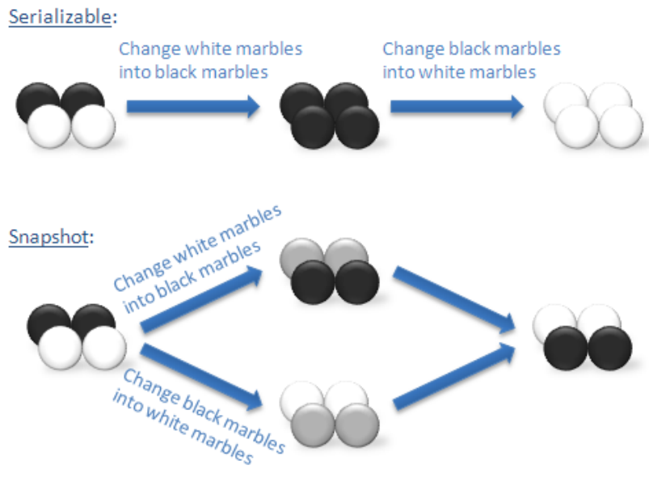

#MVCC事务机制1

MVCC是NoSQL和RDBMS中常用的事务机制。在MVCC之前，主要采用"two-phase commit"，但"two-phase commit"过程中需要对读写操作进行加锁，这会带来显著的性能问题。因此，"two-phase commit"在读写高并发场景中已被逐步摒弃。

## **Snapshot Is**olation(SI)

”snapshot isolation”的出现主要解决"two-phase commit"带来的性能底下的问题，其原理如下：

* 每一个数据都多个版本，读写能够并发进行
* 每个事务相当于看到数据的一个快照
* 写写不能并发，写写操作时需要加上行锁
* 谁加行锁，谁可以顺利执行（采用了“first win”的原则），后面的写事务要么abort，要么等待前面的事务执行完成后再执行（以Oracle 和 SQL Server 、MySQL等为代表）。

但是”snapshot isolation”带来一个大问题："**write skew**"，即写偏序问题(不能够达到串行化的事务隔离级别)。

## **Write Skew**

如下是wiki中关于"write skew"的解释：

> In a *write skew* anomaly, two transactions (T1 and T2) concurrently read an overlapping data set (e.g. values V1 and V2), concurrently make disjoint updates (e.g. T1 updates V1, T2 updates V2), and finally concurrently commit, neither having seen the update performed by the other. Were the system serializable, such an anomaly would be impossible, as either T1 or T2 would have to occur "first", and be visible to the other. In contrast, snapshot isolation permits write skew anomalies.

通俗理解：写偏序（Write Skew）是一致性约束下的异常现象，即两个并行事务都基于自己读到的数据集去覆盖另一部分数据集，在串行化情况下两个事务无论何种先后顺序，最终将达到一致状态，但SI隔离级别下无法实现。下图的“黑白球”常常被用来说明写偏序问题：

更通俗一点的例子：

> <u>数据库约束</u>： A1+A2>0
>
> A1，A2 实际值都为100
>
> <u>事务T1</u>：
>
> If （read （A1） +read （A2） >= 200）
>
> {
>
> ​	Set A1 = A1 - 200
>
> }
>
> <u>事务T2</u>：
>
> If （read （A1） +read （A2） >= 200）
>
> {
>
> ​	Set A2 = A2 - 200
>
> }

事务T2 与事务T1 并发执行相同的语句，两个事务都会执行，执行成功后A1= -100 ，A2= -100 ， A1+A2=-200，显然违背完整性约束。

## Write Snapshot Isolation

为了解决"write skew"（写偏序） 问题，出现了"Serial Snapshot Isolation"理论，其实现方法有很多种，"Write Snapshot Isolation"作为"Serial Snapshot Isolation"理论的典型代表解决"write skew"问题, 基本思想：

>  冲突检测发生在事务的运行阶段，而不是事务的提交阶段。

因此，它的原理就是：增加读写冲突检测来解决"write skew"问题。如下是"Write Snapshot Isolation"的定义：

> Similarly to Snapshot isolation，write Snapshot isolation assigns unique start and commit timestamps to transactions and ensures that txni reads the latest version of data with commit timestamp δ<Ts(txni) 

与SI 一样每个事务都有一个事务开始时间戳与事务结束时间戳。Write Snapshot isolation 需要保证一个事务读的数据的最近一个版本的提交时间要早于事务的开始时间。

换一种简单的描述：如果两个读写事务"txni"，"txnj"同时满足下面两个条件，那么这两个事务不能同时提交成功：

* 读写在空间上重叠："txni"的写操作与"txnj"的读操作发生在同一行

* 读写在时间上重叠：Ts(txni) < Tc(txnj) < Tc(txni)

  注：Ts(txni)代表txni的事务开始时间, Tc(txni)代表事务txni的事务提交时间

Write Snapshot Isolation事务虽然解决"write skew"问题，还存在另外一个难以解决的问题：**全序问题**。

基于 Snapshot isolation理论，每个事务都有两个事件：

* 事务的开始事件（时间）
* 事务的提交事件（时间）

所有的事件必须是全序的，即所有事件都有先后顺序。一般情况用时间轴表示事件的发生的前后关系，实现事件的全序。我们给事务分配一个事务的开始时间，一个事务的结束时间，这样在整个系统中，所有的事件都可以比较先后关系。

但是在分布式系统中，时间就变成一个非常大的难题，因为各个节点的时间可能有误差。而且根据侠义相对论，时空的事件并不存在一个始终如一的全序关系。如何解决？ 待续。