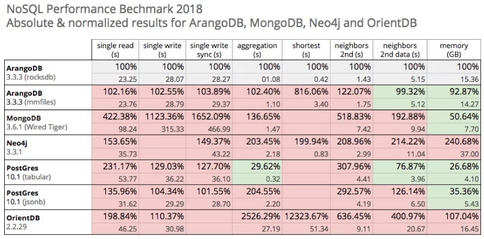

#一份2018年最新的NoSQL测试报告

最近，ArangoDB官方发布了一份关于ArangoDB与MongoDB/PostgreSQL/OrientDB/Neo4j的性能对比测试报告，出于商业宣传的目的，这份测试所选取的场景可能是ArangoDB所擅长的场景，但好在这些场景还算是一些比较普遍的场景，从客观的角度来看依然是有参考价值的。

##ArangoDB

相信关于"**One size does not always fit all**"的思想已经深入人心，然而，**ArangoDB**却定位于在一个数据库系统中，通过一种查询语言，能够同时支持如下能力：

* **文档存储**

* **图存储**

* **KeyValue存储**

这就是所谓的**Multiple Data Models**数据库，正如ArangoDB官方所提供的描述：

> One Core. One Query Language. Multiple Data Models.

Gartner于2016年10月份发布的报告《Magic Quadrant for Operational Database Management Systems》中，关于2017年的**战略规划设想**部分，曾重点提及**Multiple Data Models Database**：

> By 2017, all leading operational DBMSs will offer multiple data models, relational and nonrelational, in a single DBMS platform.
>
> By 2017, the "NoSQL" label will cease to distinguish DBMSs, leading data and analytics leaders to select multimodel and/or specific document-style, key-value, graph and table-style engines.

## 报告总览

该报告中共涉及了**单点读写，聚合统计，最短路径查询，扩线查询**等几种场景，并且与主流的文档数据库(MongoDB)、图数据库(Neo4j)、关系型数据库(PostgreSQL)以及其它Multiple Data Models Database(OrientDB)做了对比，从结果上来看：

在大多数场景中，基于RocksDB作为存储引擎的ArangoDB，均取得了非常不错的表现，尤其是在图数据库专有的"扩线查询"和"最短路径"查询中，居然远优于Neo4j，这一点倒是比较惊讶。在聚合统计上，基于Tabular存储的PostgreSQL，具有非常明显的优势。而另外一个**Multiple Data Models Database(OrientDB)**在图计算能力上的表现却差强人意。

##报告详情

###软件版本

- Neo4j 3.3.1
- MongoDB 3.6.1
- PostgreSQL 10.1 (tabular & jsonb)
- OrientDB 2.2.29
- ArangoDB 3.3.3

###测试环境

- **Server**: i3.4xlarge on AWS with 16 virtual cores, 122 GB of RAM, 1900 GB NVMe-SSD
- **Client**: c3.xlarge on AWS with four virtual CPUs, 7.5 GB of RAM and a 40 GB SSD

###测试数据

测试数据源自Pokec上的社交关系数据，由Standford University SNAP提供。这些数据中，共包含：

* 1,632,803 people（Vertices信息）
* 30,622,564 edges（Edge用来描述两个Vertices之间的关系）

关于描述people的信息包括{gender, age, hobbies, interest, education, ...}。

未压缩的原始数据大小信息：

* Vertices：  600 MB
* Edges： 1.832 GB

任意两个Vertices之间的最短路径的最大长度为11，而这些这些Vertices之间是高度相关联的，因此，如果想查询任意两个Vertices之间的最短路径是相对比较难的。

###测试场景

- **Single-read**

  读取单个Document

- **Single-write**

  写入单个Document

- **Single-write sync**

  写入单个Document，等待fsync成功

- **Aggregation**

  针对一个Collection之上的ad-hoc聚合查询，计算年龄的分布信息

- **Neighbors second**

  查找"A的朋友的朋友的"二层扩线查询，并且返回1000个不同的Vertices的ID列表。

- **Neighbors second with data** 

  查找"A的朋友的朋友的"二层扩线查询，并且返回100个不同的Vertices的详细信息(携带描述字段信息)。

- **Shortest path**

  查找任意两个Vertices之间的最短路径。

- **Memory**

  关注测试期间的平均内存使用信息。

##测试结果

### 详细结果总览

### Aggregation(聚合统计)

**结果点评**

1. 基于tabular存储的PostgreSQL具有明显的性能优势。

###Neighbors second(扩线查询)

**结果点评**

1. 仅仅返回1000个Vertices ID列表，而不涉及具体的字段信息时，基于RocksDB的ArangoDB表现最佳。
2. 同为Multiple Data Models的OrientDB在扩线查询上表现最差，甚至差于MongoDB。

**结果点评**

1. 当返回100个Vertices以及相关联的字段信息时，基于Tabular存储的PostgreSQL表现最佳。原因应该在于，返回Vertices数量的减少使得读取的数据量减少了。
2. ArangoDB的表现次优，该结果与不带数据时的结果差不多。
3. MongoDB查询携带有字段信息的结果也远优于不带字段信息的结果，原因同样应该是返回的Vertices数量减少的缘故，作为文档类型的MongoDB未对扩线查询做针对性优化也在情理之中。

### Shortest path(最短路径查询)

**结果点评**

1. 因为"最短路径查询"属于图数据库的范畴，并没有测试MongoDB与PostgreSQL。
2. "最短路径查询"其实包含两部分，第一是通过扩线查询将所需的Vertices以及Edges加载到内存中，第二是最短路径算法，而第一点往往是影响性能的关键，因此，在扩线查询上表现最佳的ArangoDB在"最短路径查询"中结果也理所当然是最佳的。

### Memory Usage(内存占用)

**结果点评**

1. 在内存占用上，基于Tabular存储的PostgreSQL表现最佳，这与PostgreSQL底层优秀的压缩与编码机制有关。
2. Neo4j的内存占用最大，从这点上看的出来，Neo4j是依赖于Caching来提升性能的。

##最后的总结

作为**Multiple Data Models**的ArangoDB在图存储能力上以及单点读写能力上，均有不错的表现，但"百万顶点，千万条边"的数据量级，似乎是偏小了一些，尤其是在测试实时写入时的"10万个Documents"实在是太小。如果将数据量放大以后，相信这些测试结果的排序将会带来一些变化。

关于测试报告详情，感兴趣的同学可以参考下面参考信息中的链接，原文中附有测试源代码的路径。

*参考信息*

1. https://www.arangodb.com/

2. [NoSQL Performance Benchmark 2018 – MongoDB, PostgreSQL, OrientDB, Neo4j and ArangoDB](https://www.arangodb.com/2018/02/nosql-performance-benchmark-2018-mongodb-postgresql-orientdb-neo4j-arangodb/)

   ​

