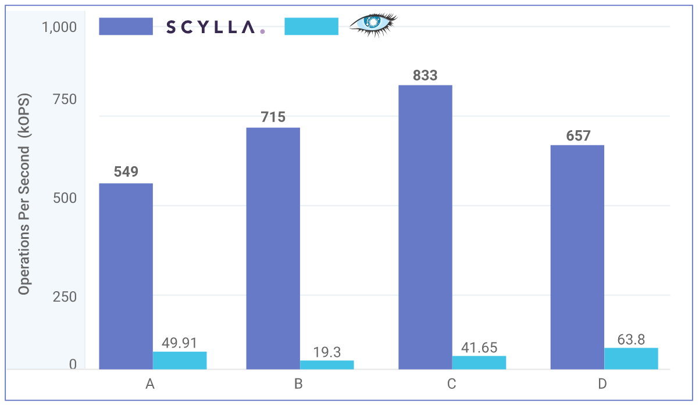
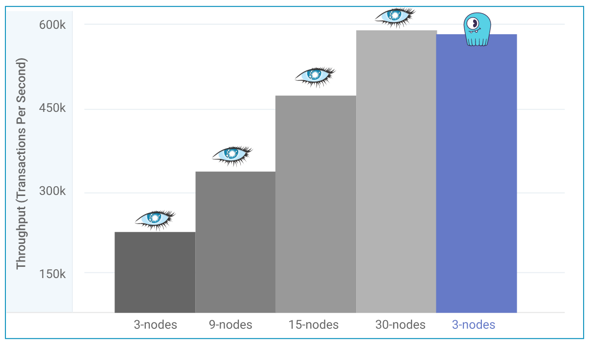
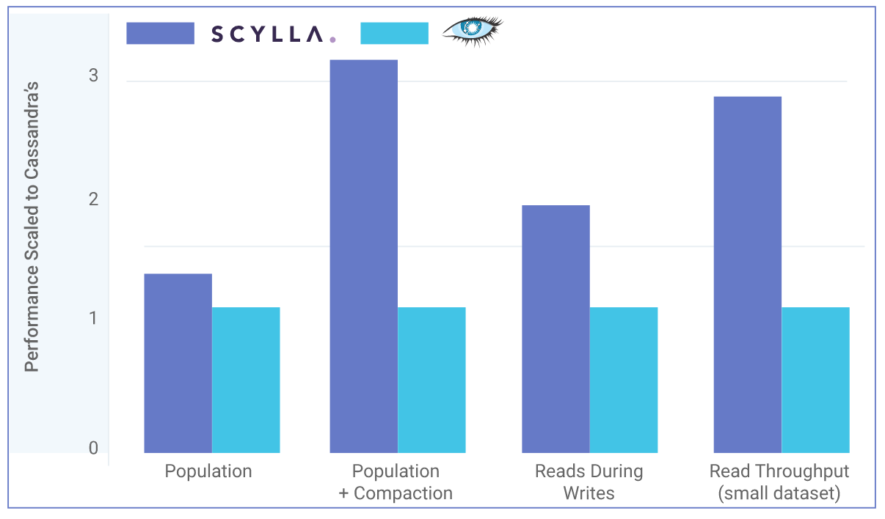

#号称十倍性能于Cassandra的ScyllaDB，究竟祭出了哪些技术"利器"？

将一种现行流行的技术，换一种语言来重写，多以失败告终，但用C++重写Cassandra的ScyllaDB可谓是一个成功的典范。基于Seastar的ScyllaDB，能够很好的发挥新型硬件的优势，这是ScyllaDB性能有质的突破的一大重要原因。本文探讨ScyllaDB的一些关键技术。

###Benchmark

先来看看ScyllaDB官方发布的几组与Cassandra的性能对比数据：

**Samsung Benchmark**

> Throughput of ScyllaDB vs Apache Cassandra Using 2TB Data for Different YCSB Workloads



**<u>点评</u>**：基于Samsung NVMe SSDs的对比测试结果，从吞吐量来看，ScyllaDB可以说将Cassandra"蹂躏"的有点"惨无人道"，两者已经不在同一个数量级上。


**YCSB Benchmark**

> Scylla vs Apache Cassandra Using only 3 Scylla Nodes



**<u>点评</u>**：用30个节点的Cassandra才能比肩用3个节点的Scylla。


**AWS c3.2xlarge**

> Throughput Results of Scylla 1.6 vs Apache Cassandra 3.0 Using Amazon Web Server c3.2xlarge 



**<u>点评</u>**：基于Amazon Web Server c3.2xlarge的对比测试，后端存储基于EBS，可以看出来，Scylla依然有明显的优势。


另外值得一提的是，Scylla在IBMPower上的运行速度，要比基于X86的速度快68%。关于这些测试，本文不详细讨论，感兴趣的同学可以参考本文参考信息部分的链接中的详细报告。接下来，我们重点讨论，ScyllaDB究竟采用了哪些关键技术/设计，从而带来了如此明显的性能优势？


###用C++重写Cassandra

在JVM之上，我们费尽周折减少Java对象的数量，优化Java GC参数甚至是改进Java GC算法，尽可能的将内存移至Offheap区或者参考操作系统内存分页的技术将内存自己最管理起来，所有这些，都是为了减少Java GC的影响进一步提升系统吞吐量，而且的确也可以取得一定的效果。

ScyllaDB干脆使用了C++来重写Cassandra，而NewSQL阵营的Kudu也选择了C++，记得在15年大数据大会期间，我曾经问过Kudu的作者Todd Lipcon这样一个问题：Kudu选择C++的初衷是什么？他略微思考后说出了两个原因：

* Java GC
* 团队成员大多为C++背景

ScyllaDB的CTO *Avi Kivity*，正是KVM的核心作者，选择C++更在情理之中。


###异步编程框架

采用了基于事件驱动的异步编程框架，而这部分是由Seastar实现的。Seastar中实现了广泛的Future/Promise接口，而且实现了一些独立的数据结构，从而能够更好的发挥新型硬件的优势。


### Shard Per Core

在传统的架构中，Shard并不感知CPU Core，这会带来几个方面的问题：

* 锁竞争：在高并发场景下，锁竞争所带来的时间消耗通常占据较高的比例
* Cache竞争：如典型的“伪共享”问题：缓存系统中是以缓存行(Cache line)为单位存储的，如果多线程间的Cache数据可能位于同一个缓存行中，就会互相影响彼此的性能
* 无法发挥NUMA架构的CPU优势：NUMA架构下，将CPU划分为若干个Chip，每一个Chip有自己的内存控制器及内存插槽，而CPU访问自己Chip上的内存时速度非常快（比访问其它CPU的内存快3倍左右）

而Scylla选择了Shard Per Core的设计，即每一个Shard与一个CPU Core绑定，尽可能的降低了锁/Cache方面的竞争，对于NUMA架构的CPU又非常友好。


### 用户空间的资源调度

我们知道，普通磁盘的读取速度远慢于CPU/Memory的读取速度，于是，在一个分布式存储系统中，我们经常看到如下现象：

```
latency mean               ：     51.9
latency median             ：     9.8
latency 95th percentile    ：     125.6
latency 99th percentile    ：     1184.0 (x 22)
latency 99.9th percentile  ：     1991.2 (x 38) 
```

也就是说，P99/P99.9时延是远大于平均时延的。当然导致这个问题的原因可能很复杂，Scylla通过提供了用户空间的资源调度器(I/O调度,CPU调度)之后，使得P99/P99.9时延降低到原来的**20%**左右。


###基于用户空间的TCP/IP协议栈

基于Linux之上的现有网络功能已经非常成熟稳定了，但对于网络时延敏感的一些应用，却存在如下几点限制：

* **基于内核空间的实现**：意味着上下文切换是一个耗时操作，还需要进行用户空间与内核空间的数据复制
* **分时共享**：当有新的包需要处理时，依赖于中断机制来通知内核
* **基于线程的模型**：强依赖于**锁机制**

因此，Seastar实现了用户空间的TCP/IP协议栈，Seastar的Native Working真正实现了"**zero-copy, zero-lock, zero-context-switch**"。当前，Seastar能够支持四种网络模型：

- Linux standard socket APIs
- Seastar native stack vhost on Linux
- Virtio device on OSv

* **DPDK** networking on Linux   

**DPDK**本身就是为了**高性能包处理**而诞生的，处理一个包通常小于80 CPU Cycles。


### 自治理

相对于传统静态配置的NoSQL系统，Scylla采用了"自治理"能力，也就是说，能够基于集群运行时的实时信息动态调整运行参数，ScyllaDB的CEO Dor Laor这么描述该特性：

> Our vision is to provide a database that dynamically tunes itself to varying conditions while always maintaining a high level of performance, regardless of any administrative operation. Scylla 2.0 moves us much closer to this goal and sets our company apart from others in the industry.


###总结

上文中提到的很多能力，都得益于**Seastar**框架，ScyllaDB可以说在与新型硬件的结合上，往前迈进了很大的一步。ScyllaDB重写了Cassandra，而Cassandra最让人诟病的地方在于多副本之间数据不一致时经常需要手动修复来搞定，ScyllaDB的当前能力似乎也无法避免该问题，另外一点，虽然ScyllaDB能够充分的利用底层硬件的IOPS，但长时间运行后的Compaction带来的冗余IOPS消耗，也是一个不容忽视的关键点，期待能看到ScyllaDB在这一点上的突破。


*参考信息*

1. [Scylla Architecture](http://docs.scylladb.com/architecture/)
2. [Scylla Benchmarks](https://www.scylladb.com/product/benchmarks/)
3. https://www.slideshare.net/ScyllaDB
4. http://www.seastar-project.org/
5. [A rock and a hard place: Between ScyllaDB and Cassandra](http://www.zdnet.com/article/a-rock-and-a-hard-place-between-scylladb-and-cassandra/)
6. [ScyllaDB Announces 2.0 Release of Its Open Source NoSQL Database](https://www.scylladb.com/press-release/scylladb-announces-2-0-release-open-source-nosql-database/)
7. http://cenalulu.github.io/linux/numa/