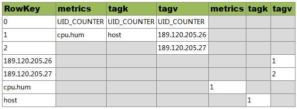
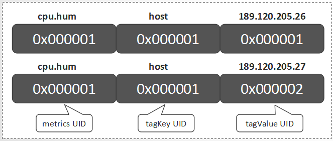

###什么是时序数据？

Wiki中关于"**时间序列（Time Series）**"的定义：

> **时间序列**（Time Series）是一组按照时间发生先后顺序进行排列的**数据点序列**，通常一组时间序列的时间间隔为一恒定值（如1秒，5分钟，1小时等）。

**时间序列数据**可被简称为**时序数据**。

**实时监控**系统所收集的监控指标数据，通常就是**时序数据** 。时序数据具有如下特点：

- 每一个**时间序列**通常为某一**固定类型**的**数值**
- 数据按一定的时间间隔持续产生，每条数据拥有自己的**时间戳**信息
- 通常只会不断的**写入**新的数据，几乎不会有**更新**、**删除**的场景
- 在读取上，也往往倾向于**读取最近写入**的数据。

正是因为这些特点，通常使用专门的时序数据库来存储，因为这类数据库更能理解**时序数据((TSDB))**的特点，而且在读写上做一些针对性的优化。相信在在即将大范围普及的**物联网(IoT)**应用场景中，**时序数据库(TSDB)**会得到更加广泛的应用。

### OpenTSDB

OpenTSDB是其中一种**时序数据库**实现，因为基于HBase生态构建而获得了广泛的关注。目前，华为云的CloudTable服务已经推出了OpenTSDB特性。

如下是源自OpenTSDB官方资料中的时序数据样例：

> sys.cpu.user host=webserver01              1356998400  50
>
> sys.cpu.user host=webserver01,cpu=0  1356998400  1
>
> sys.cpu.user host=webserver01,cpu=1  1356998400  0
>
> sys.cpu.user host=webserver01,cpu=2  1356998400  2
>
> sys.cpu.user host=webserver01,cpu=3  1356998400  0
>
> ............
>
> sys.cpu.user host=webserver01,cpu=63 1356998400  1

对于上面的任意一行数据，在OpenTSDB中称之为一个**时间序列**中的一个**Data Point**。以最后一行为例我们说明一下OpenTSDB中关于Data Point的每一部分组成定义如下：

| 构成信息     | 名称        |
| ------------ | ----------- |
| sys.cpu.user | **metrics** |
| host         | tagKey      |
| webserver01  | tagValue    |
| cpu          | tagKey      |
| 63           | tagValue    |
| 1356998400   | timestamp   |
| 1            | value       |

可以看出来，每一个Data Point，都关联一个metrics名称，但可能关联多组\<tagKey,tagValue\>信息。而关于时间序列，事实上就是具有相同的metrics名称以及相同的\<tagKey,tagValue\>组信息的Data Points的集合。在存储这些Data Points的时候，大家也很容易可以想到，可以将这些metrics名称以及\<tagKey,tagValue\>信息进行特殊编码来优化存储，否则会带来极大的数据冗余。OpenTSDB中为每一个metrics名称，tagKey以及tagValue都定义了一个唯一的数字类型的标识码(UID)。

###UID设计

UID的全称为Unique Identifier。这些UID信息被保存在OpenTSDB的元数据表中，默认表名为"tsdb-uid"。

OpenTSDB分配UID时遵循如下规则：

* metrics、tagKey和tagValue的UID分别独立分配
* 每个metrics名称（tagKey/tagValue）的UID值都是唯一。不存在不同的metrics（tagKey/tagValue）使用相同的UID，也不存在同一个metrics（tagKey/tagValue）使用多个不同的UID
* UID值的范围是0x000000到0xFFFFFF，即metrics（或tagKey、tagValue）最多只能存在16777216个不同的值。

###元数据HBase表设计

为了从UID索引到metrics（或tagKey、tagValue），同时也要从metrics（或tagKey、tagValue）索引到UID，OpenTSDB同时保存这两种映射关系数据。

在元数据表中，把这两种数据分别保存到两个名为"id"与"name"的Column Family中，Column Family描述信息如下所示：

```
{NAME => 'id', BLOOMFILTER => 'ROW', COMPRESSION => 'SNAPPY'}                                                                                                                                   
{NAME =>'name',BLOOMFILTER => 'ROW', COMPRESSION => 'SNAPPY', MIN_VERSIONS => '0', BLOCKCACHE => 'true', BLOCKSIZE => '65536', REPLICATION_SCOPE => '0'}
```

###元数据模型

关于metrics名为"cpu.hum"，tagKey为"host"，但"tagValue"值分别为"189.120.205.26"、"189.120.205.27"的UID信息定义如下：

	

说明：

1. RowKey为"0"的行中，分别保存了metrics、tagKey和tagValue的当前UID的最大值。当为新的metrics、tagKey和tagValue分配了新的UID后，会更新对应的最大值
2. RowKey为"1"的行中，RowKey为UID，Qualifier为"id:metrics"的值"metrics"，Qualifier为"id:tagk"的值为tagKey，Qualifier为id:tagv的值为tagValue
3. RowKey为"2"的行中，RowKey为UID，Qualifier为"id:tagv"的值为tagValue，暂不存在UID为"2"的metrics和tagKey
4. RowKey为"189.120.205.26"的行中，Qualifer为"name:tagv"的值为UID。表示当"189.120.205.26"为tagValue时，其UID为1
5. RowKey为"189.120.205.27"的行中，Qualifer为"name:tagv"的值为UID。表示当"189.120.205.26"为tagValue时，其UID为2
6. RowKey为"cpu.hum"的行中，Qualifer为"name:metrics"的值为UID。表示当cpu.hum为metrics时，其UID为1
7. RowKey为"host"的行中，Qualifer为"name:tagk"的值为UID。表示当host为tagValue时，其UID为1

由于HBase的存储数据类型是Bytes，所以UID在存储时会被转换为3个字节长度的Bytes数组进行存储。

## TSUID

对每一个Data Point，metrics、timestamp、tagKey和tagValue都是必要的构成元素。除timestamp外，metrics、tagKey和tagValue的UID就可组成一个TSUID，每一个TSUID关联一个**时间序列**，如下所示：

>  \<metrics_UID\>\<tagKey1_UID\>\<tagValue1_UID\>[...\<tagKeyN_UID\>\<tagValueN_UID\>]

在上一章节的例子中，就涉及两个TSUID，分别是：

