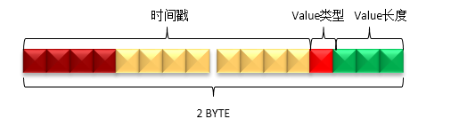
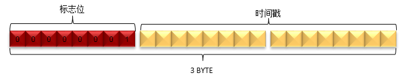

OpenTSDB的数据表中，共涉及两种类型的数据：Metrics数据以及Annotation(注释)数据，在将这些数据存到HBase表中时，针对RowKey, Qualifier以及Value信息都做了特殊设计，从而使得存储更加高效，本文重点介绍这些设计。

## Metrics RowKey设计

metrics数据的HBase RowKey中包含主要组成部分为：盐值（Salt）、metrics名称、时间戳、tagKey、tagValue等部分。上篇文章已经讲到，为了统一各个值的长度以及节省空间，对metrics名称、tagKey和tagValue分配了UID信息。所以，在HBase RowKey中实际写入的metrics UID、tagKey UID和tagValue UID。

HBase RowKey的数据模型如下图所示：

 

* **SALT**：建议开启SALT功能，可以有效提高性能。SALT数据的长度是变长的：如果SALT的值值少于256，那么只用一个字节表示即可；如果需要设置更大的SALT值，也会相应地占用更多的空间。
* **Metric ID**：metrics名经过编码后，每个Metric ID的长度为三个字节。
* **Timestamp**：这里的时间戳是以小时为单位的，也就是以秒为单位的真实时间戳/3600计算得到的值。
* **tagKey UID** & **tagValue UID**：tagKey和tagValue经过编码后，每个tagKey UID和tagValue UID的长度都为三个字节。tagKey UID和tagValue UID必须成对出现，最少必须存在1对，最多存在8对。

## Metrics Qualifier设计

Qualifier用于保存一个或多个DataPoint中的时间戳、数据类型、数据长度等信息。

由于时间戳中的小时级别的信息已经保存在RowKey中了，所以Qualifier只需要保存一个小时中具体某秒或某毫秒的信息即可，这样可以减少数据占用的空间。

一个小时中的某一秒（少于3600）最多需要2个字节即可表示，而某一毫秒（少于3600000）最多需要4个字节才可以表示。为了节省空间，OpenTSDB没有使用统一的长度，而是对特定的类型采用特性的编码方法。

Qualifer的数据模型主要分为如下三个情况：秒、毫秒、秒和毫秒混合。

### 秒类型

当OpenTSDB接收到一个新的DataPoint的时候，如果请求中的时间戳是秒，那么就会插入一个如下模型的数据。

判断请求中的时间戳为秒或毫秒的方法是基于时间戳数值的大小，如果时间戳的值的超过无符号整数的最大值（即4个字节的长度），那么该时间戳是毫秒，否则为秒。

* **Value**长度：Value的实际长度是Qualifier的最后3个bit的值加1，即(qualifier & 0x07) + 1。表示该时间戳对应的值的字节数。所以，值的字节数的范围是1到8个字节。
* **Value类型**：Value的类型由Qualifier的倒数第4个bit表示，即(qualifier & 0x08)。如果值为1，表示Value的类型为float；如果值为0，表示Value的类型为long。
* **时间戳**：时间戳的值由Qualifier的第1到第12个bit表示，即(qualifier & 0xFFF0) >>>4。由于秒级的时间戳最大值不会大于3600，所以qualifer的第1个bit肯定不会是1。

### 毫秒类型

当OpenTSDB接收到一个新的DataPoint的时候，如果请求中的时间戳是毫秒，那么就会插入一个如下模型的数据。

 

* **Value**长度：与秒类型相同。
* **Value类型**：与秒类型相同。
* **时间戳**： 时间戳的值由Qualifier的第5到第26个bit表示，即(qualifier & 0x0FFFFFC0) >>>6。
* **标志位**：标志位由Qualifier的前4个bit表示。当该Qualifier表示毫秒级数据时，必须全为1，即(qualifier[0] & 0xF0) == 0xF0。
* 第27到28个bit未使用。

### 混合类型

当同一小时的数据发生合并后，就会形成混合类型的Qualifier。

合并的方法很简单，就是按照时间戳顺序进行排序后，从小到大依次拼接秒类型和毫秒类型的Qualifier即可。

 

* 秒类型和毫秒类型的数量没有限制，并且可以任意组合。
* 不存在相同时间戳的数据，包括秒和毫秒的表示方式。
* 遍历混合类型中的所有DataPoint的方法是：
  * 从左到右，先判断前4个bit是否为0xF
  * 如果是，则当前DataPoint是毫秒型的，读取4个字节形成一个毫秒型的DataPoint
  * 如果否，则当前DataPoint是秒型的，读取2个字节形成一个秒型的DataPoint
  * 以此迭代即可遍历所有的DataPoint

## Metrics Value设计

HBase Value部分用于保存一个或多个DataPoint的具体某个时间戳对应的值。

由于在Qualifier中已经保存了DataPoint Value的类型和DataPoint Value的长度，所以无论是秒级还是毫秒级的值，都可以用相同的表示方法，而混合类型就是多个DataPoint Value的拼接。

HBase Value按照长度可以分为如下几种类型：

### 单字节

当DataPoint Value为long型，且大于等于-128（Byte.MIN_VALUE），且少于或等于127（Byte.MAX_VALUE）的时候，使用1个字节存储。

### 两字节

当DataPoint Value为long型，且大于等于-32768（Short.MIN_VALUE），且少于或等于32767（Short.MAX_VALUE）的时候，使用2个字节存储。

### 四字节

当DataPoint Value为long型，且大于等于0x80000000（Integer.MIN_VALUE），且少于或等于0x7FFFFFFF（Integer.MAX_VALUE）的时候，使用4个字节存储。

### 八字节

当DataPoint Value为long型，且不是上面三种类型的时候，使用8个字节存储。

当DataPoint Value为float型的时候，使用8个字节表示。

### 多字节

按照时间戳的顺序，把多个Value拼接起来的数据模型如下：

* 每个格子表示一个DataPoint Value的值，这个DataPoint Value的长度可能是1或2或4或8个字节。
* DataPoint Value的顺序与Qualifier中时间戳的顺序一一对应。
* **混合**标志：如果最后1个字节为0x01，表示存在秒级类型和毫秒级类型混合的情况。

# Annotation数据

Annotation用于描述某一个时间点发生的事件，Annotation的数据为字符串类型，这与数字类型的metrics数据并不同。

> **注意**：
>
> 1. Annotation数据只支持秒级时间戳的数据。
> 2. Annotation数据不会合并。

## Annotation RowKey设计

RowKey的数据模型如下图：

* SALT/ Timestamp/Metric UID/ tagKey UID /tagValue UID的意义与metrics RowKey中的意义相同。
* 把[Metric UID/ tagKey UID /tagValue UID]部分统称为TSUID。实际上，读写注释数据的时候，需要指定的是TSUID，而不是像metrics数据中那样分开指定的。

## Annotation Qualifier设计

由于注释数据只支持秒级类型的数据，同时注释类型的数据不支持合并，所以Qualifier的设计相对metrics数据简单一些。Qualifier定义如下：

 

- 与metrics数据的Qualifier相比，注释数据的HBase Qualifer的长度是3个字节。
- **标志位**：使用第1个字节表示，而且值必须为0x01。即(qualifier & 0xFF0000)>>>16 == 0x01。
- **时间戳**：使用第2到第3个字节表示。即时间戳的值为(qualifier & 0x00FFFF)。

## Annotation Value设计

注释数据中的Value保存的是字符串类型的数据，整个HBase Value部分就是注释数据的值。

##Append模式

当OpenTSDB启动APPEND模式后，每个插入的新DataPoint，都会以HBase的append的方式写入。

> 注意：
>
> 1. 由于使用了HBase的append的接口，每次插入一个新数据，都需要对同一小时的数据都执行一次读取和插入的操作；另外多线程对同一小时的数据进行更新的时候，是不能并发的。这样就大大限制了数据写入的速度了，一般情况下不建议使用这种模式。
> 2. append的数据其实就是合并过的数据了，所以不会参与OpenTSDB的Compaction流程。

## Append模式RowKey设计

Append模式的RowKey设计与普通模式下写入的metrics数据的RowKey是相同的。

## Append模式Qualifier设计

Append模式下，由于同1小时的数据中不存在多个Qualifier，所以只需要使用一个固定的Qualifier即可。

* Append模式的Qualifier使用3个字节表示
* 标志位： 由第1个字节表示，而且值必须为0x05。即(qualifier & 0xFF0000)>>>16 == 0x05
* 固定部分：由第2到第3个字节表示，这部分的值固定为0x0000，因此，Append模式的Qualifier固定为0x050000

## Append模式Value设计

Append模式下， Value部分既要保存时间戳，数值类型和数值长度，也要保存对应的数值。

Value的数据结构如下：

* 上图每一个方块表示的Qualifier与Value的定义，与普通写入模式下的定义相同
* 遍历Value中的所有DataPoint的方法是：
  * 从左到右，先判断前4个bit是否为0xF
  * 如果是，则当前DataPoint是毫秒型的读取4个字节形成一个毫秒型的Qualifier，从Qualifier中获得Value的长度，然后再读取对应长度的字节数
  * 如果否，则当前DataPoint是秒型的，读取2个字节形成一个秒型的Qualifier，从Qualifier中获得Value的长度，然后再读取对应长度的字节数；
  * 依此迭代即可遍历所有的DataPoint。