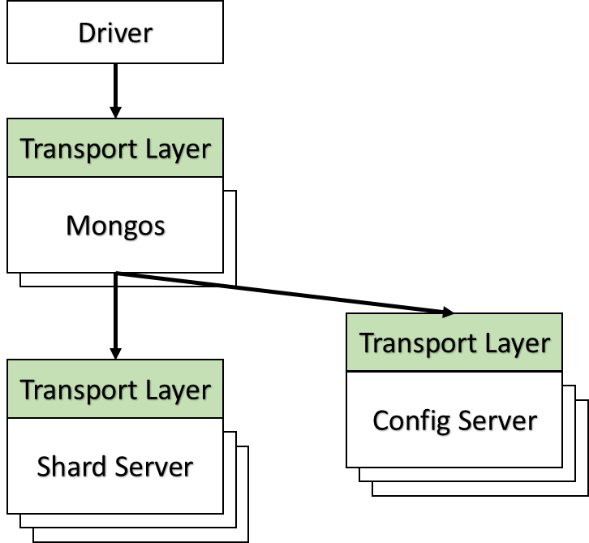

#MongoDB技术分析（1）-TransportLayer

MongoDB是非常流行的分布式文档型NOSQL数据库，拥有很好的性能表现和扩展能力，并且具有Scheme-free，以及丰富的二级索引和周边生态，在互联网应用中有着广泛的使用场景。笔者因为工作原因接触到MongoDB数据库，在查找MongoDB的文档时发现大多是介绍怎么使用的文档，对MongoDB的内部实现原理介绍的很少，因此把自己对MongoDB 3.4版本代码的理解记录并分享出来。

MongoDB主体上包含3个子系统：Mongos、ShardServer、ConfigServer；Mongos负责将请求路由到对应的ShardServer节点，ShardServer负责具体的数据库业务逻辑处理，ConfigServer负责集群管理等工作。

本文介绍的TransportLayer是MongoDB的一个基础模块，负责网络服务端的收发包处理逻辑，是Monogs、ShardServer和ConfigServer中接收网络请求的公共模块，所有网络请求首先达到TransportLayer模块，然后再转交由业务模块处理。

#TransportLayer的业务逻辑

  
如上图所示，TransportLayer包含如下几个功能：

- 启动时创建listener线程监听网络端口，接受客户端连接请求；
> 如果没有配置bind_ip，3.4版本会监听0.0.0.0即所有IP地址，3.6版本为增加安全性改成了监听127.0.0.1，默认只能本机访问，应该是收MongoDB数据库被劫持事件的影响。

- 收到新连接后建立会话，并创建新的conn线程处理该连接的后续请求；
> 3.4版本是为每个网络连接创建一个专用线程，并同步调用网络接口recv/send收发包；  
> 3.6版本做了较大修改，引入了boost.asio库实现网络接口的异步调用并作为默认配置，同时还把线程模型调整为线程池，动态根据workload压力情况调整线程数量，在大量连接情况下可以避免产生大量的处理线程，降低线程切换开销，以获得更稳定的性能表现。

- conn线程循环处理：sourceMessage从网络收包，processMessage处理业务逻辑，sinkMessage发送响应请求给客户端；
> 该部分逻辑在mongos或mongod的service_entry_point文件中_sessionLoop函数中实现，进一步根据message的类型走不同COMMAND的处理流程。

#TransportLayer模块设计
  

- ListenerLegacy类负责监听端口，接收新连接；  
- MessagingPort类负责具体收发包处理 
- TransportLayerLegacy的_handleNewConnection函数会判断是否超过允许的最大连接数  
- LegacySession维持一个连接中多次操作的会话关系  
- LegacyTicket增加收发包超时机制