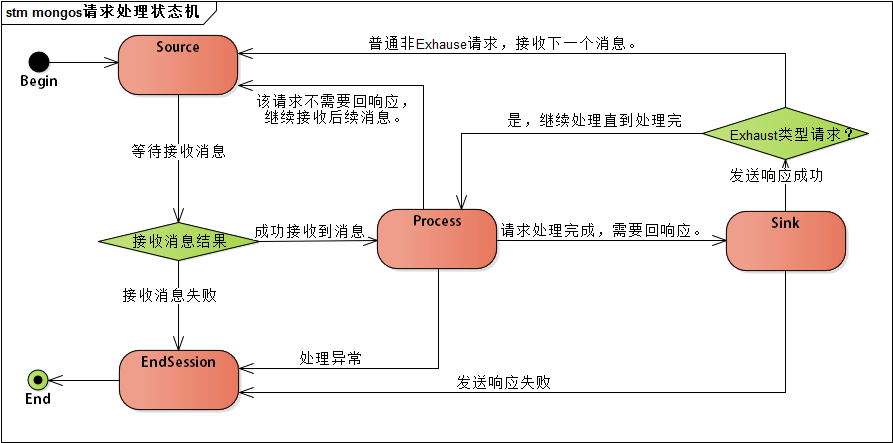
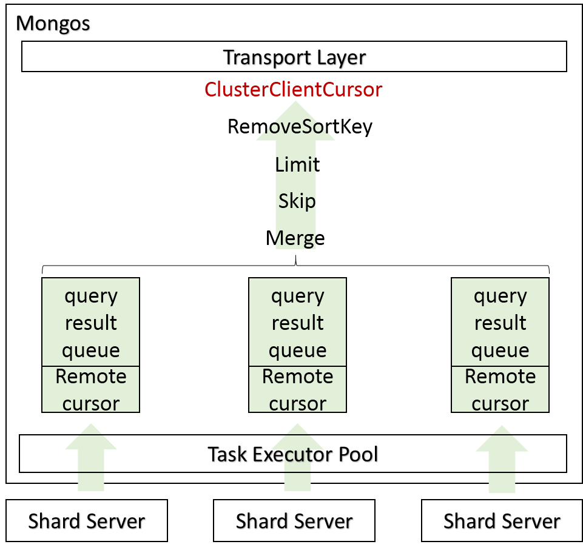

#MongoDB技术分析（2）- Mongos 请求处理逻辑

前面介绍了TransportLayer作为MongoDB的网络服务端处理模块，负责和客户端的网络请求交互。那么当TransportLayer接收到客户请求后，MongoDB怎么进一步进行业务处理呢？本文以查询请求为例介绍mongos怎么把请求转发到shard server，并正确处理查询结果的。

#请求处理状态机

TransportLayer接收到新连接后，会创建专门的conn线程负责处理该连接的后续所有请求，具体逻辑在ServiceEntryPointMongos类的_sessionloop函数中，根据请求的类型循环“收包，处理，回响应”三个步骤，总结状态机转换关系如下：

具体到Process业务处理里面，会进一步区分消息类型并走不同处理逻辑，主要分为：查询类（queryop/getmore）, 更新类（insert/update/delete），killcursors，以及其他ClientCommand这几种类型。

这几类命令的前半段处理流程基本类似，包括鉴权，语法判断，根据分区视图查找本次操作涉及哪些shardserver，以及错误重试机制。后半段则和具体业务逻辑相关，存在较大差异。

#查询请求处理逻辑

因为是Sharding集群模式下的查询，根据查询条件的不同，可能会涉及到多个Shard Server的数据，根据分区视图确认涉及的Shard Server后，针对每个ShardServer生成一个查询任务交由TaskExecutorPool执行。TaskExecutorPool负责维护mongos到ShardServer的长连接，并包含一个network线程池负责执行和ShardServer的网络交互。

Conn线程将查询任务交由TaskExecutorPool任务队列后，会wait到信号量上阻塞等待，TaskExecutorPool里的network线程完成查询请求后，唤醒Conn线程进一步处理查询结果。

Mongos为每一个Shard Server维护一个查询结果缓存队列，并按照Merge、Skip、Limit、RemoveSortKey的顺序对查询结果进行逐级处理后返回。其中Merge操作负责合并来自多个Shard Server的查询结果，根据查询条件是否要求排序有不同的处理逻辑：
需要排序：根据SortKey在多个队列中找排最前面的，保证全局有序返回，缓存结果处理完了就触发到对应ShardServer查询数据；
不需要排序：一个Shard Server查询结果返回完了再返回下一个ShardServer的查询结果；

Mongos还会为每次查询创建一个ClusterCursor，并维护和每个远程Shard Server游标的对应关系，用于后续getmore操作进一步获取数据。

#总    结

Mongos作为Sharding集群的路由节点，负责根据查询条件及分区视图将查询请求路由到对应的ShardServer，并正确处理来自多个ShardServer的查询结果。对于查询请求来说，使用pipeline的线程模型，conn线程负责和客户端的交互，并把查询请求交给network线程，network线程再负责和ShardServer的网络交互。